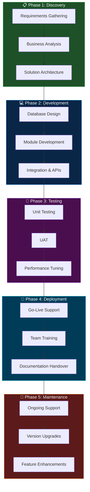

<div align="center">

<!-- ═══════════════════════════════════════════════════════════════ -->
<!-- 🎨 ULTRA ENHANCED HEADER WITH 3D EFFECT -->
<!-- ═══════════════════════════════════════════════════════════════ -->


<!-- ═══════════════════════════════════════════════════════════════ -->
<!-- ⚡ DYNAMIC TYPING ANIMATION - ENHANCED -->
<!-- ═══════════════════════════════════════════════════════════════ -->


<!-- ═══════════════════════════════════════════════════════════════ -->
<!-- 🔗 SOCIAL LINKS - PREMIUM STYLE -->
<!-- ═══════════════════════════════════════════════════════════════ -->

<p align="center">
  <a href="https://www.linkedin.com/in/ibrahim-mahmoud-ibrahim" target="_blank">
    
  </a>
  <a href="mailto:ibrahimelmasry631@gmail.com">
    
  </a>
  <a href="https://github.com/Elmasry-631" target="_blank">
    
  </a>
  <a href="https://wa.me/201000000000" target="_blank">
    
  </a>
</p>

<!-- Profile Views Counter with Animation -->
<p align="center">
  
  
</p>

</div>

---

<!-- ═══════════════════════════════════════════════════════════════ -->
<!-- 🏆 ULTRA ACHIEVEMENTS SECTION - 3D CARDS -->
<!-- ═══════════════════════════════════════════════════════════════ -->

<div align="center">

##  Impact Metrics & Proven Results

<table>
<tr>
<td width="25%" align="center">

### 📊 Projects Delivered


</td>
<td width="25%" align="center">

### 🌍 Regional Coverage


</td>
<td width="25%" align="center">

### 🏭 Industries Served


</td>
<td width="25%" align="center">

### ⚡ Efficiency Gains


</td>
</tr>

<tr>
<td width="25%" align="center">

### 😊 Client Satisfaction


</td>
<td width="25%" align="center">

### 🎧 Support Availability


</td>
<td width="25%" align="center">

### 📜 Odoo Certified


</td>
<td width="25%" align="center">

### 📅 Years Experience


</td>
</tr>
</table>

</div>

---

<!-- ═══════════════════════════════════════════════════════════════ -->
<!-- 👨‍💻 ABOUT ME - ENHANCED PYTHON CODE BLOCK -->
<!-- ═══════════════════════════════════════════════════════════════ -->

<div align="center">

##  <samp><span style="color:#00D9FF;">class</span> <span style="color:#FFFFFF;">IbrahimElmasry</span>:</samp>

```python
#!/usr/bin/env python3
"""
╔═══════════════════════════════════════════════════════════════════╗
║                                                                   ║
║   ██████╗ ███████╗████████╗██████╗  █████╗ ██████╗ ██╗   ██╗     ║
║  ██╔════╝ ██╔════╝╚══██╔══╝██╔══██╗██╔══██╗██╔══██╗╚██╗ ██╔╝     ║
║  ██║  ███╗█████╗     ██║   ██████╔╝███████║██████╔╝ ╚████╔╝      ║
║  ██║   ██║██╔══╝     ██║   ██╔══██╗██╔══██║██╔══██╗  ╚██╔╝       ║
║  ╚██████╔╝███████╗   ██║   ██║  ██║██║  ██║██║  ██║   ██║        ║
║   ╚═════╝ ╚══════╝   ╚═╝   ╚═╝  ╚═╝╚═╝  ╚═╝╚═╝  ╚═╝   ╚═╝        ║
║                                                                   ║
║           Senior Odoo Developer & ERP Architect                  ║
║         Specializing in Business Automation Solutions            ║
║              Across MENA Region Since 2020                        ║
║                                                                   ║
╚═══════════════════════════════════════════════════════════════════╝
"""

from typing import Dict, List, Optional
from dataclasses import dataclass
from enum import Enum


class ExpertiseLevel(Enum):
    EXPERT = "Expert"
    ADVANCED = "Advanced"
    INTERMEDIATE = "Intermediate"


@dataclass
class Technology:
    name: str
    level: ExpertiseLevel
    years_of_experience: int


@dataclass
class ClientProject:
    company_name: str
    industry: str
    country: str
    year: int
    scope: str


class IbrahimElmasry:
    """
    Senior Odoo Developer & ERP Architect with extensive experience 
    in delivering end-to-end business automation solutions across 
    multiple industries and countries in the MENA region.
    
    Attributes:
        name (str): Full professional name
        title (str): Professional designation
        experience_years (int): Years of professional experience
        projects_delivered (int): Total projects completed successfully
        client_retention_rate (float): Percentage of returning clients
    """
    
    def __init__(self):
        self.name = "Ibrahim Elmasry"
        self.title = "Senior Odoo Developer | ERP Architect | Business Automation Expert"
        self.experience_years = 5
        self.projects_delivered = 54
        self.countries_served = [
            "Egypt", "Saudi Arabia", "UAE", 
            "Qatar", "Jordan", "Iraq"
        ]
        self.client_retention_rate = 99.0
        self.languages = ["Arabic", "English"]
        
    @property
    def core_technologies(self) -> List[Technology]:
        """Primary technical expertise"""
        return [
            Technology("Odoo 15/16/17/18", ExpertiseLevel.EXPERT, 5),
            Technology("Python 3.x", ExpertiseLevel.EXPERT, 6),
            Technology("PostgreSQL", ExpertiseLevel.EXPERT, 5),
            Technology("XML/QWeb", ExpertiseLevel.EXPERT, 5),
            Technology("JavaScript", ExpertiseLevel.ADVANCED, 4),
            Technology("Django", ExpertiseLevel.ADVANCED, 3),
            Technology("FastAPI", ExpertiseLevel.INTERMEDIATE, 2),
            Technology("Redis", ExpertiseLevel.ADVANCED, 3),
            Technology("Docker", ExpertiseLevel.ADVANCED, 3),
            Technology("Git", ExpertiseLevel.EXPERT, 5),
        ]
    
    @property
    def specializations(self) -> Dict[str, List[str]]:
        """Areas of deep specialization"""
        return {
            "ERP Solutions": [
                "Full-cycle Implementation",
                "Custom Module Development",
                "Multi-company Configuration",
                "Data Migration & Cleansing",
            ],
            "Business Domains": [
                "Non-Profit Organizations",
                "Retail & E-commerce",
                "Manufacturing & Production",
                "Construction & Contracting",
                "Healthcare & Pharmaceuticals",
                "Hospitality & Restaurants",
            ],
            "Technical Skills": [
                "API Integration (REST/SOAP)",
                "Workflow Automation",
                "POS System Integration",
                "Report Development (QWeb/PDF)",
                "Arabic Localization",
            ],
        }
    
    @property
    def industries_served(self) -> List[str]:
        """Complete list of industries served"""
        return [
            "Non-Profit Foundations",
            "Libraries & Bookstores",
            "Manufacturing & Factories",
            "Construction & Contracting",
            "Food & Restaurants",
            "Healthcare & Medical",
            "Petroleum & Industrial",
            "Trading & Retail",
            "Fashion & Marketing",
            "Technology & IT",
            "Real Estate & Tourism",
            "Finance & Investment",
            "Insurance Companies",
            "Legal Services",
            "Sports & Entertainment",
            "Pharmaceuticals",
            "Home & Living",
            "Hospitality & Events",
        ]
    
    def get_value_proposition(self) -> Dict[str, str]:
        """Why clients choose to work with me"""
        return {
            "deep_analysis": "Understanding unique business needs before writing code",
            "scalable_solutions": "Built to grow and adapt with your business",
            "best_practices": "Clean, maintainable, well-documented codebase",
            "future_proof": "Easy upgrades and modifications as needs evolve",
            "local_expertise": "Deep understanding of MENA market requirements",
            "bilingual_support": "Full Arabic & English documentation & training",
        }
    
    def get_contact_info(self) -> Dict[str, str]:
        """Professional contact information"""
        return {
            "email": "ibrahimelmasry631@gmail.com",
            "linkedin": "linkedin.com/in/ibrahim-mahmoud-ibrahim",
            "github": "github.com/Elmasry-631",
            "location": "Cairo, Egypt (Serving MENA Region)",
            "availability": "Open for new projects & collaborations",
        }
    
    def __repr__(self) -> str:
        return f"<IbrahimElmasry: {self.title} | {self.projects_delivered}+ Projects>"


# Instantiate the expert
if __name__ == "__main__":
    ibrahim = IbrahimElmasry()
    print(f"✅ {ibrahim.name} - Ready to transform your business!")
```

</div>

---

<!-- ═══════════════════════════════════════════════════════════════ -->
<!-- 💎 VALUE PROPOSITION - WHY CHOOSE ME -->
<!-- ═══════════════════════════════════════════════════════════════ -->

<div align="center">

## 💡 The Ibrahim Advantage

<table>
<tr>
<td width="50%" valign="top">

### 🎯 Technical Excellence
| Approach | Description |
|:---------|-------------|
| **Deep Analysis** | Understanding unique business needs before coding |
| **Scalable Architecture** | Built to grow with your business |
| **Clean Code** | Maintainable, documented, best practices |
| **Future-Proof** | Easy upgrades and modifications |

</td>
<td width="50%" valign="top">

### 🤝 Partnership Model
| Benefit | What You Get |
|:--------|--------------|
| **Free Consultation** | Initial assessment at no cost |
| **Transparent Pricing** | No hidden fees, clear milestones |
| **Team Training** | Empower your team fully |
| **Ongoing Support** | Post-delivery maintenance |

</td>
</tr>
</table>

</div>

---

<!-- ═══════════════════════════════════════════════════════════════ -->
<!-- 🌍 GEOGRAPHIC FOOTPRINT - INTERACTIVE MAP STYLE -->
<!-- ═══════════════════════════════════════════════════════════════ -->

<div align="center">

##  Geographic Footprint & Market Presence

<table>
<tr>
<th>🇪🇬 Egypt</th>
<th>🇸🇦 Saudi Arabia</th>
<th>🇦🇪 UAE</th>
<th>🇶🇦 Qatar</th>
<th>🇯🇴 Jordan</th>
<th>🇮🇶 Iraq</th>
</tr>
<tr>
<td align="center">
<b>Primary Base</b><br/>
<sub>Strategic Hub</sub><br/>

</td>
<td align="center">
<b>Major Market</b><br/>
<sub>Largest Client Base</sub><br/>

</td>
<td align="center">
<b>Growing Presence</b><br/>
<sub>Dubai & RAK</sub><br/>

</td>
<td align="center">
<b>Established</b><br/>
<sub>Doha Region</sub><br/>

</td>
<td align="center">
<b>Expansion</b><br/>
<sub>Amman</sub><br/>

</td>
<td align="center">
<b>Active</b><br/>
<sub>Baghdad</sub><br/>

</td>
</tr>
</table>

</div>

---

<!-- ═══════════════════════════════════════════════════════════════ -->
<!-- 📋 COMPLETE CLIENT PORTFOLIO - 54 PROJECTS -->
<!-- ═══════════════════════════════════════════════════════════════ -->

<div align="center">

##  Complete Client Portfolio — 54 Successful Implementations

</div>

<div align="center">

<table>
<tr>
<th>#</th>
<th>Client Name</th>
<th>Industry Sector</th>
<th>Country</th>
<th>#</th>
<th>Client Name</th>
<th>Industry Sector</th>
<th>Country</th>
</tr>
<tr>
<td><b>01</b></td>
<td>Flexible Service for General Contracting</td>
<td>🏗️ Construction & Contracting</td>
<td>🇸🇦 SA</td>
<td><b>28</b></td>
<td>Grove Restaurant</td>
<td>🍽️ Food & Restaurants</td>
<td>🇸🇦 SA</td>
</tr>
<tr>
<td><b>02</b></td>
<td>Monish</td>
<td>🍽️ Food & Restaurants</td>
<td>🇸🇦 SA</td>
<td><b>29</b></td>
<td>Palazzo Ballroom</td>
<td>🎭 Hospitality & Events</td>
<td>🇸🇦 SA</td>
</tr>
<tr>
<td><b>03</b></td>
<td>Dam Construction LLC</td>
<td>🏗️ Construction & Contracting</td>
<td>🇦🇪 AE</td>
<td><b>30</b></td>
<td>Holy Restaurant</td>
<td>🍽️ Food & Restaurants</td>
<td>🇸🇦 SA</td>
</tr>
<tr>
<td><b>04</b></td>
<td>Protect Ever</td>
<td>🏥 Healthcare</td>
<td>🇪🇬 EG</td>
<td><b>31</b></td>
<td>Saud Al-Turaif Establishment</td>
<td>🏗️ Construction & Contracting</td>
<td>🇸🇦 SA</td>
</tr>
<tr>
<td><b>05</b></td>
<td>House Covers Industries</td>
<td>🏠 Home & Living</td>
<td>🇪🇬 EG</td>
<td><b>32</b></td>
<td>Islamic Bank Restaurant</td>
<td>🍽️ Food & Restaurants</td>
<td>🇸🇦 SA</td>
</tr>
<tr>
<td><b>06</b></td>
<td>Bonanza RAK</td>
<td>⛽ Petroleum & Industrial</td>
<td>🇦🇪 AE</td>
<td><b>33</b></td>
<td>Al Muttahida Cotton Factory</td>
<td>🏭 Manufacturing</td>
<td>🇸🇦 SA</td>
</tr>
<tr>
<td><b>07</b></td>
<td>ILaw (UAE)</td>
<td>⚖️ Legal & Professional</td>
<td>🇦🇪 AE</td>
<td><b>34</b></td>
<td>Al Najmah Restaurant</td>
<td>🍽️ Food & Restaurants</td>
<td>🇸🇦 SA</td>
</tr>
<tr>
<td><b>08</b></td>
<td>Rose Palace</td>
<td>🎭 Hospitality & Events</td>
<td>🇸🇦 SA</td>
<td><b>35</b></td>
<td>Ashal Hujuzat</td>
<td>🎭 Hospitality & Events</td>
<td>🇸🇦 SA</td>
</tr>
<tr>
<td><b>09</b></td>
<td>Kholoud Al-Saadawi Factory</td>
<td>🏭 Manufacturing</td>
<td>🇸🇦 SA</td>
<td><b>36</b></td>
<td>Titan X</td>
<td>⚽ Sports</td>
<td>🇶🇦 QA</td>
</tr>
<tr>
<td><b>10</b></td>
<td>The Qaed Quality Leader</td>
<td>⚖️ Legal & Professional</td>
<td>🇸🇦 SA</td>
<td><b>37</b></td>
<td>Advanced Care</td>
<td>🏥 Healthcare</td>
<td>🇶🇦 QA</td>
</tr>
<tr>
<td><b>11</b></td>
<td>Galal Rahem Ben Abdelrahim Elmaghraby</td>
<td>🍽️ Food & Restaurants</td>
<td>🇸🇦 SA</td>
<td><b>38</b></td>
<td>Al Zhbya International</td>
<td>👗 Fashion & Marketing</td>
<td>🇶🇦 QA</td>
</tr>
<tr>
<td><b>12</b></td>
<td>Neo Ship</td>
<td>💻 Technology</td>
<td>🇶🇦 QA</td>
<td><b>39</b></td>
<td>Amber</td>
<td>🛒 Trading & Retail</td>
<td>🇶🇦 QA</td>
</tr>
<tr>
<td><b>13</b></td>
<td>Romeya for Marketing</td>
<td>👗 Fashion & Marketing</td>
<td>🇶🇦 QA</td>
<td><b>40</b></td>
<td>Golden Market for Trading</td>
<td>🛒 Trading & Retail</td>
<td>🇪🇬 EG</td>
</tr>
<tr>
<td><b>14</b></td>
<td>Perla</td>
<td>🛒 Trading & Retail</td>
<td>🇶🇦 QA</td>
<td><b>41</b></td>
<td>Pure Supplies</td>
<td>🛒 Trading & Retail</td>
<td>🇪🇬 EG</td>
</tr>
<tr>
<td><b>15</b></td>
<td>Qatar Modern Factory for Tyres</td>
<td>🏭 Manufacturing</td>
<td>🇶🇦 QA</td>
<td><b>42</b></td>
<td>Chicken I Land Restaurant</td>
<td>🍽️ Food & Restaurants</td>
<td>🇪🇬 EG</td>
</tr>
<tr>
<td><b>16</b></td>
<td>Dalton</td>
<td>🛒 Trading & Retail</td>
<td>🇪🇬 EG</td>
<td><b>43</b></td>
<td>TOYOU Company</td>
<td>💰 Finance & Investment</td>
<td>🇪🇬 EG</td>
</tr>
<tr>
<td><b>17</b></td>
<td>Royal Star for Plastic Industry</td>
<td>🏭 Manufacturing</td>
<td>🇪🇬 EG</td>
<td><b>44</b></td>
<td>Vera Fashion</td>
<td>👗 Fashion & Marketing</td>
<td>🇮🇶 IQ</td>
</tr>
<tr>
<td><b>18</b></td>
<td>Hummer Furniture Factory</td>
<td>🏭 Manufacturing</td>
<td>🇪🇬 EG</td>
<td><b>45</b></td>
<td>Innovadigits</td>
<td>💻 Technology</td>
<td>🇪🇬 EG</td>
</tr>
<tr>
<td><b>19</b></td>
<td>Qasr Almariyah</td>
<td>🏨 Real Estate & Tourism</td>
<td>🇮🇶 IQ</td>
<td><b>46</b></td>
<td>Diamond Supply</td>
<td>🛒 Trading & Retail</td>
<td>🇸🇦 SA</td>
</tr>
<tr>
<td><b>20</b></td>
<td>Trie Oxygen (Dubai)</td>
<td>🏭 Manufacturing</td>
<td>🇦🇪 AE</td>
<td><b>47</b></td>
<td>Mid Core Farma</td>
<td>💊 Pharmaceuticals</td>
<td>🇪🇬 EG</td>
</tr>
<tr>
<td><b>21</b></td>
<td>Soltan Elabtekar</td>
<td>🛒 Trading & Retail</td>
<td>🇪🇬 EG</td>
<td><b>48</b></td>
<td>Reach World</td>
<td>🏨 Real Estate & Tourism</td>
<td>🇯🇴 JO</td>
</tr>
<tr>
<td><b>22</b></td>
<td>Traid Paint</td>
<td>⛽ Petroleum & Industrial</td>
<td>🇪🇬 EG</td>
<td><b>49</b></td>
<td>Sarwa Life</td>
<td>🛡️ Insurance</td>
<td>🇪🇬 EG</td>
</tr>
<tr>
<td><b>23</b></td>
<td>Magawish Petroleum Company</td>
<td>⛽ Petroleum & Industrial</td>
<td>🇪🇬 EG</td>
<td><b>50</b></td>
<td>Sarwa Insurance</td>
<td>🛡️ Insurance</td>
<td>🇪🇬 EG</td>
</tr>
<tr>
<td><b>24</b></td>
<td>Haitara</td>
<td>🏗️ Construction & Contracting</td>
<td>🇶🇦 QA</td>
<td><b>51</b></td>
<td>Katra</td>
<td>🏭 Manufacturing</td>
<td>🇸🇦 SA</td>
</tr>
<tr>
<td><b>25</b></td>
<td>Alaz for Food Industry</td>
<td>⛽ Petroleum & Industrial</td>
<td>🇪🇬 EG</td>
<td><b>52</b></td>
<td>Al-Tawreed Al-Masi</td>
<td>🛒 Trading & Retail</td>
<td>🇸🇦 SA</td>
</tr>
<tr>
<td><b>26</b></td>
<td>Izdehar</td>
<td>⛽ Petroleum & Industrial</td>
<td>🇸🇦 SA</td>
<td><b>53</b></td>
<td>Panda Retail</td>
<td>🛒 Trading & Retail</td>
<td>🇪🇬 EG</td>
</tr>
<tr>
<td><b>27</b></td>
<td><b>Mohammed Bin Ahmed Al-Jumaih Foundation</b></td>
<td><b>🏛️ Non-Profit Foundation</b></td>
<td>🇸🇦 SA</td>
<td><b>54</b></td>
<td><b>Adlas</b></td>
<td><b>📚 Libraries & Bookstores</b></td>
<td>🇸🇦 SA</td>
</tr>
</table>

</div>

---

<!-- ═══════════════════════════════════════════════════════════════ -->
<!-- ⭐ FEATURED PROJECTS SHOWCASE -->
<!-- ═══════════════════════════════════════════════════════════════ -->

<div align="center">

## ⭐ Featured Implementations — Case Studies

<table>
<tr>
<td width="33%" align="center" valign="top">

### 🏛️ Non-Profit Excellence
#### Mohammed Bin Ahmed Al-Jumaih Foundation


**Scope of Work:**
- Donation management system
- Volunteer coordination portal
- Financial tracking & reporting
- Multi-department workflow automation
- Arabic/English bilingual interface

</td>
<td width="33%" align="center" valign="top">

### 📚 Retail Innovation
#### Adlas Libraries


**Scope of Work:**
- Multi-branch inventory management
- Advanced POS integration
- Supplier & procurement automation
- Customer loyalty program
- Real-time stock synchronization

</td>
<td width="33%" align="center" valign="top">

### 🏭 Manufacturing Power
#### Royal Star Plastic Industry


**Scope of Work:**
- Production planning optimization
- Quality control workflows
- BOM management system
- Raw material tracking
- Automated costing calculations

</td>
</tr>
</table>

</div>

---

<!-- ═══════════════════════════════════════════════════════════════ -->
<!-- 🛠️ TECHNICAL ARSENAL - SKILL BARS -->
<!-- ═══════════════════════════════════════════════════════════════ -->

<div align="center">

##  Technical Arsenal & Skill Matrix

<table>
<tr>
<th colspan="2">Programming Languages</th>
<th colspan="2">Frameworks & ERP</th>
</tr>
<tr>
<td width="25%" align="center">


<br/><br/>


<br/><br/>


</td>
<td width="25%" align="center">


<br/><br/>


<br/><br/>


</td>
<td width="25%" align="center">


<br/><br/>


<br/><br/>


</td>
<td width="25%" align="center">


<br/><br/>


<br/><br/>


</td>
</tr>
</table>

<br/>

<table>
<tr>
<th>Databases & Caching</th>
<th>DevOps & Tools</th>
<th>Specialized Skills</th>
</tr>
<tr>
<td width="33%" align="center">


</td>
<td width="33%" align="center">


</td>
<td width="34%" align="center">


</td>
</tr>
</table>

</div>

---

<!-- ═══════════════════════════════════════════════════════════════ -->
<!-- 🔧 DEVELOPMENT WORKFLOW - VISUAL PIPELINE -->
<!-- ═══════════════════════════════════════════════════════════════ -->

<div align="center">

## 🔧 My Development Process — From Concept to Launch


```mermaid
flowchart TB
    subgraph Phase1["📋 Phase 1: Discovery"]
        A[Requirements Gathering] --> B[Business Analysis]
        B --> C[Solution Architecture]
    end
    
    subgraph Phase2["💻 Phase 2: Development"]
        C --> D[Database Design]
        D --> E[Module Development]
        E --> F[Integration & APIs]
    end
    
    subgraph Phase3["🧪 Phase 3: Testing"]
        F --> G[Unit Testing]
        G --> H[UAT]
        H --> I[Performance Tuning]
    end
    
    subgraph Phase4["🚀 Phase 4: Deployment"]
        I --> J[Go-Live Support]
        J --> K[Team Training]
        K --> L[Documentation Handover]
    end
    
    subgraph Phase5["🔄 Phase 5: Maintenance"]
        L --> M[Ongoing Support]
        M --> N[Version Upgrades]
        N --> O[Feature Enhancements]
    end

    style Phase1 fill:#1E5128,color:#fff,stroke:#2EA043
    style Phase2 fill:#0A2647,color:#fff,stroke:#1E90FF
    style Phase3 fill:#4A0E4E,color:#fff,stroke:#A855F7
    style Phase4 fill:#003C58,color:#fff,stroke:#00D9FF
    style Phase5 fill:#5C1A1A,color:#fff,stroke:#F97316
```

</div>

---

<!-- ═══════════════════════════════════════════════════════════════ -->
<!-- 🚀 COMPREHENSIVE SERVICES -->
<!-- ═══════════════════════════════════════════════════════════════ -->

<div align="center">

##  Comprehensive Service Offering

<table>
<tr>
<td valign="top">

### 🎯 Odoo Implementation
| Service | Details |
|:--------|---------|
| Full-cycle ERP deployment | End-to-end setup & configuration |
| Module configuration | Tailored to your business needs |
| User training & docs | Comprehensive onboarding |
| Go-live support | Smooth transition guarantee |

</td>
<td valign="top">

### ⚙️ Custom Development
| Service | Details |
|:--------|---------|
| Custom modules & apps | Bespoke functionality |
| Workflow automation | Streamlined processes |
| Report customization | QWeb/PDF reports |
| UI/UX enhancements | User-friendly interfaces |

</td>
<td valign="top">

### 🔌 Integrations
| Service | Details |
|:--------|---------|
| Payment gateways | Multiple providers |
| Third-party APIs | REST/SOAP integration |
| E-commerce platforms | Webstore sync |
| SMS/Email services | Notifications |

</td>
<td valign="top">

### 📦 Data Migration
| Service | Details |
|:--------|---------|
| Legacy system data | Safe transfer |
| Data cleansing | Quality assurance |
| Validation & testing | Accuracy guaranteed |
| Post-migration audit | Verification complete |

</td>
</tr>
</table>

<br/>

<table>
<tr>
<td valign="top">

### ⚡ Process Automation
- Workflow optimization
- Approval workflows
- Notification systems
- Automated reporting

</td>
<td valign="top">

### 🛠️ Support & Maintenance
- Bug fixes & patches
- Performance optimization
- Version upgrades
- Security updates

</td>
<td valign="top">

### 🏢 Multi-company Setup
- Multi-branch management
- Inter-company transactions
- Currency management
- Consolidated reporting

</td>
<td valign="top">

### 🛒 POS Solutions
- Hardware integration
- Offline capability
- Receipt customization
- Kitchen display systems

</td>
</tr>
</table>

</div>

---

<!-- ═══════════════════════════════════════════════════════════════ -->
<!-- 💬 TESTIMONIALS -->
<!-- ═══════════════════════════════════════════════════════════════ -->

<div align="center">

## 💬 Client Testimonials

<table>
<tr>
<td width="50%" valign="top">

<blockquote>
<i>"Ibrahim transformed our entire operation from day one. His deep understanding of the Saudi market combined with his Odoo expertise saved us months of development time and significant costs."</i>
<br/><br/>
<b>— CEO, Major Saudi Retail Chain</b>
<br/><sub>🇸🇦 Riyadh, Saudi Arabia</sub>
</blockquote>

</td>
<td width="50%" valign="top">

<blockquote>
<i>"Professional, responsive, and consistently delivers quality work on time. His ability to understand complex business requirements and translate them into working solutions is remarkable."</i>
<br/><br/>
<b>— IT Director, UAE Construction Company</b>
<br/><sub>🇦🇪 Dubai, UAE</sub>
</blockquote>

</td>
</tr>
<tr>
<td width="50%" valign="top">

<blockquote>
<i>"The non-profit foundation implementation was flawless. Ibrahim handled donation tracking, volunteer management, and financial reporting with exceptional attention to detail."</i>
<br/><br/>
<b>— Operations Manager, Al-Jumaih Foundation</b>
<br/><sub>🇸🇦 Saudi Arabia</sub>
</blockquote>

</td>
<td width="50%" valign="top">

<blockquote>
<i>"Our multi-branch library network is now fully integrated thanks to the custom solution built for us. Inventory accuracy improved by 95% after implementation."</i>
<br/><br/>
<b>— General Manager, Adlas Libraries</b>
<br/><sub>🇸🇦 Saudi Arabia</sub>
</blockquote>

</td>
</tr>
</table>

</div>

---

<!-- ═══════════════════════════════════════════════════════════════ -->
<!-- 📊 GITHUB STATS - ENHANCED -->
<!-- ═══════════════════════════════════════════════════════════════ -->

<div align="center">

##  GitHub Activity & Contribution Metrics


<br/>


<br/>


</div>

---

<!-- ═══════════════════════════════════════════════════════════════ -->
<!-- 🏆 TROPHIES & ACHIEVEMENTS -->
<!-- ═══════════════════════════════════════════════════════════════ -->

<div align="center">


</div>

---

<!-- ═══════════════════════════════════════════════════════════════ -->
<!-- 🎯 CURRENT FOCUS & GOALS -->
<!-- ═══════════════════════════════════════════════════════════════ -->

<div align="center">

## 🎯 Current Focus & Strategic Goals

<table>
<tr>
<td width="33%" align="center" valign="top">

### 📈 Odoo 18/19 Migration Specialist
Helping businesses upgrade seamlessly to latest versions with zero downtime and enhanced features.


</td>
<td width="33%" align="center" valign="top">

### 🤖 AI-Powered ERP Solutions
Exploring artificial intelligence integration within Odoo ecosystem for predictive analytics.


</td>
<td width="33%" align="center" valign="top">

### 🌐 SaaS Platform Development
Building scalable multi-tenant Odoo solutions for cloud-based delivery.


</td>
</tr>
</table>

</div>

---

<!-- ═══════════════════════════════════════════════════════════════ -->
<!-- 🤝 CALL TO ACTION - CONTACT ME -->
<!-- ═══════════════════════════════════════════════════════════════ -->

<div align="center">

##  Ready to Transform Your Business?

<p align="center">
  <i>Let's discuss how Odoo can streamline your operations, automate your workflows, and drive sustainable growth.</i>
</p>

<p align="center">
  <b>🆓 Free Initial Consultation • ✨ Custom Solutions • 🔄 Ongoing Support</b>
</p>

<br/>

<table>
<tr>
<td align="center">

<a href="mailto:ibrahimelmasry631@gmail.com">
  
</a>

</td>
<td align="center">

<a href="https://www.linkedin.com/in/ibrahim-mahmoud-ibrahim" target="_blank">
  
</a>

</td>
<td align="center">

<a href="https://github.com/Elmasry-631" target="_blank">
  
</a>

</td>
<td align="center">

<a href="https://wa.me/201000000000" target="_blank">
  
</a>

</td>
</tr>
</table>

<br/>

<!-- Random Quote Widget -->


</div>

---

<!-- ═══════════════════════════════════════════════════════════════ -->
<!-- 🎨 FOOTER - ANIMATED WAVE -->
<!-- ═══════════════════════════════════════════════════════════════ -->


<div align="center">

<table>
<tr>
<td align="center">


<br/>
<sub><b>Crafted with passion by Ibrahim Elmasry</b></sub>
<br/>
<sub>Last Updated: 2025 | Built for excellence</sub>

</td>
</tr>
</table>

<p>
  
  
  
</p>

</div>
