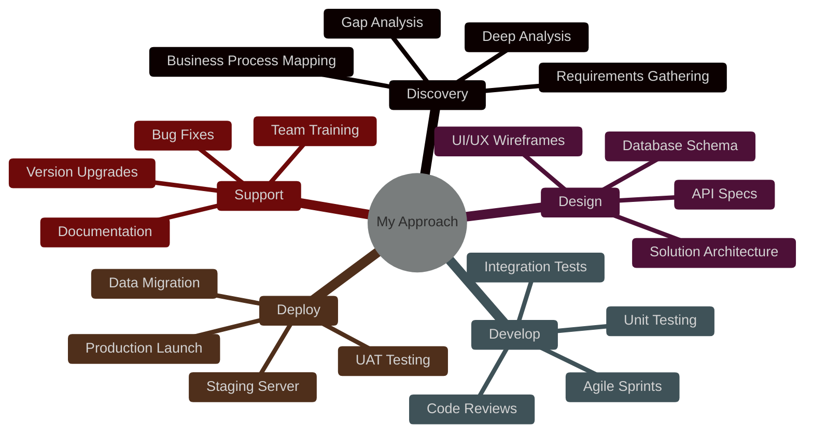
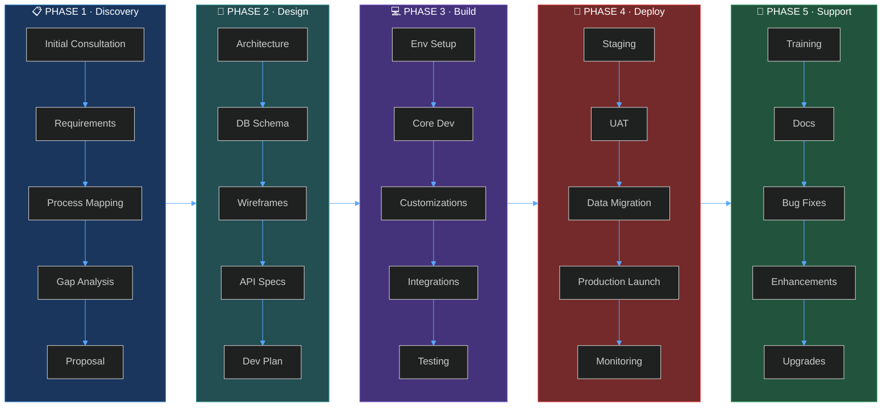

<!-- ═══════════════════════════════════════════════════════════════════════════ -->
<!--                    I B R A H I M   E L M A S R Y                            -->
<!--              Senior Odoo Developer · ERP Architect · v2026                  -->
<!-- ═══════════════════════════════════════════════════════════════════════════ -->

<div align="center">

<!-- 🌌 COSMIC HEADER -->


<!-- ⚡ QUANTUM TYPING -->
<a href="https://git.io/typing-svg">

</a>

<br/><br/>

<!-- 🔮 NEON SOCIAL LINKS -->
<a href="https://www.linkedin.com/in/ibrahim-mahmoud-ibrahim" target="_blank"></a>
<a href="mailto:ibrahimelmasry631@gmail.com"></a>
<a href="https://github.com/Elmasry-631" target="_blank"></a>
<a href="https://wa.me/20XXXXXXXXXX" target="_blank"></a>
<a href="https://x.com/elmasry_631" target="_blank"></a>
<a href="https://www.youtube.com/@elmasry631" target="_blank"></a>

<br/>

<!-- ULTRA STATUS BAR -->


</div>

---

<!-- ═══════════════════════════════════════════════════════════════════════════ -->
<!-- ▓▓▓  LIVE TERMINAL  ▓▓▓                                                     -->
<!-- ═══════════════════════════════════════════════════════════════════════════ -->

<div align="center">

```console
┌─[ibrahim@cairo]─[~/erp]───────────────────────────────────────────────┐
│                                                                       │
│  $ whoami                                                             │
│  > Senior Odoo Developer · ERP Architect · Automation Expert          │
│                                                                       │
│  $ cat /etc/location                                                  │
│  > Cairo · Egypt 🇪🇬  →  Serving 🇸🇦 🇦🇪 🇶🇦 🇯🇴 🇮🇶 🇪🇬           │
│                                                                       │
│  $ systemctl status ibrahim.service                                   │
│  > ● active (running)  •  uptime: 5 years  •  load: 54 projects       │
│                                                                       │
│  $ ibrahim --stack                                                    │
│  > Odoo 15–18  |  Python 3  |  PostgreSQL  |  XML/QWeb  |  Docker     │
│                                                                       │
│  $ ibrahim --availability                                             │
│  > ✅ Open for freelance & full-time opportunities                    │
│                                                                       │
└───────────────────────────────────────────────────────────────────────┘
```

</div>

---

<!-- ═══════════════════════════════════════════════════════════════════════════ -->
<!-- ▓▓▓  QUICK IMPACT STATS  ▓▓▓                                                -->
<!-- ═══════════════════════════════════════════════════════════════════════════ -->

<div align="center">

## ⚡ Quick Impact Stats

<table>
<tr>
<td align="center" width="16.66%">

### 📊 **54+**
*Projects Done*
<br/>


</td>
<td align="center" width="16.66%">

### 👥 **45+**
*Happy Clients*
<br/>


</td>
<td align="center" width="16.66%">

### 🌍 **6**
*Countries Served*
<br/>


</td>
<td align="center" width="16.66%">

### 🏭 **18**
*Industries*
<br/>


</td>
<td align="center" width="16.66%">

### ⏱️ **4–6w**
*Avg Delivery*
<br/>


</td>
<td align="center" width="16.66%">

### ⭐ **9.8/10**
*Satisfaction*
<br/>


</td>
</tr>
</table>

</div>

---

<!-- ═══════════════════════════════════════════════════════════════════════════ -->
<!-- ▓▓▓  DETAILED PERFORMANCE DASHBOARD  ▓▓▓                                    -->
<!-- ═══════════════════════════════════════════════════════════════════════════ -->

<div align="center">

## 📈 Performance Analytics Dashboard

<table>
<tr>
<td align="center" width="33%" valign="top">
<details open>
<summary><b>🎯 Project Excellence</b></summary>
<br/>

| Metric | Value | Benchmark |
|:-------|:-----:|:---------:|
| Total Projects | **54+** | Top 5% |
| On-Time Delivery | **98%** | Industry: 75% |
| Bug-Free Rate | **99.5%** | Exceptional |
| Client Retention | **99%** | Premium |
| Repeat Business | **85%** | High Trust |
| Referral Rate | **78%** | Word of Mouth |

</details>
</td>
<td align="center" width="34%" valign="top">
<details open>
<summary><b>🌍 Market Penetration</b></summary>
<br/>

| Region | Clients | Share |
|:-------|:-------:|:-----:|
| 🇸🇦 Saudi Arabia | 20 | 38% |
| 🇪🇬 Egypt (HQ) | 19 | 28% |
| 🇶🇦 Qatar | 9 | 14% |
| 🇦🇪 UAE | 4 | 10% |
| 🇮🇶 Iraq | 2 | 6% |
| 🇯🇴 Jordan | 1 | 4% |

</details>
</td>
<td align="center" width="33%" valign="top">
<details open>
<summary><b>🏭 Sector Distribution</b></summary>
<br/>

| Industry | Projects | Trend |
|:---------|:--------:|:-----:|
| 🍽️ Food & Restaurant | 10+ | 🔥 Hot |
| 🛒 Trading & Retail | 10+ | 📈 Growing |
| 🏭 Manufacturing | 8+ | ✅ Stable |
| 🏗️ Construction | 4+ | 📊 Moderate |
| 🎭 Hospitality | 3+ | 🆕 Emerging |
| Others | 19+ | 🔄 Active |

</details>
</td>
</tr>
</table>

</div>

---

<!-- ═══════════════════════════════════════════════════════════════════════════ -->
<!-- ▓▓▓  ABOUT ME — FULL CODE CLASS  ▓▓▓                                        -->
<!-- ═══════════════════════════════════════════════════════════════════════════ -->

<div align="center">

## 👨‍💻 `from ibrahim_elmasry import *`

</div>

```python
#!/usr/bin/env python3
# -*- coding: utf-8 -*-
"""
╔═══════════════════════════════════════════════════════════════════════════╗
║                                                                           ║
║   ██████╗ ██╗   ██╗██████╗  █████╗ ███╗   ██╗██████╗ ██╗███╗   ██╗████████╗
║  ██╔════╝ ██║   ██║██╔══██╗██╔══██╗████╗  ██║██╔══██╗██║████╗  ██║╚══██╔══╝
║  ██║  ███╗██║   ██║██████╔╝███████║██╔██╗ ██║██║  ██║██║██╔██╗ ██║   ██║
║  ██║   ██║██║   ██║██╔══██╗██╔══██║██║╚██╗██║██║  ██║██║██║╚██╗██║   ██║
║  ╚██████╔╝╚██████╔╝██████╔╝██║  ██║██║ ╚████║██████╔╝██║██║ ╚████║   ██║
║   ╚═════╝  ╚═════╝ ╚═════╝ ╚═╝  ╚═╝╚═╝  ╚═══╝╚═════╝ ╚═╝╚═╝  ╚═══╝   ╚═╝
║                                                                           ║
║                   Ibrahim Elmasry · v2026.1                               ║
║    Senior Odoo Developer | ERP Architect | Business Automation            ║
║                                                                           ║
╚═══════════════════════════════════════════════════════════════════════════╝
"""

import random
from dataclasses import dataclass, field
from typing import Dict, List
from enum import Enum


class SkillLevel(Enum):
    """Proficiency levels for technical skills."""
    EXPERT       = ("Expert",       95)
    ADVANCED     = ("Advanced",     80)
    INTERMEDIATE = ("Intermediate", 65)

    def __init__(self, label: str, percentage: int):
        self.label = label
        self.percentage = percentage


@dataclass(frozen=True)
class Technology:
    """A technology skill with a visual progress bar."""
    name: str
    level: SkillLevel
    years_experience: int
    category: str

    @property
    def proficiency_bar(self) -> str:
        filled = "█" * (self.level.percentage // 5)
        empty  = "░" * (20 - self.level.percentage // 5)
        return f"[{filled}{empty}] {self.level.percentage}%"

    @property
    def indicator(self) -> str:
        if self.level.percentage >= 90:   return "🟢"
        if self.level.percentage >= 70:   return "🟡"
        return "🟠"


@dataclass
class ClientProject:
    """A completed client project with full details."""
    id: int
    name: str
    industry: str
    country: str
    year: int
    technologies: List[str]
    scope: str
    satisfaction: int            # 1-10
    duration_weeks: int
    team_size: int

    @property
    def complexity(self) -> str:
        if self.duration_weeks > 8:  return "🔴 Enterprise"
        if self.duration_weeks > 4:  return "🟡 Advanced"
        return "🟢 Standard"


class IbrahimElmasry:
    """
    ════════════════════════════════════════════════════════════════════
    Senior Odoo Developer & ERP Architect serving the MENA region.
    ════════════════════════════════════════════════════════════════════
    """

    def __init__(self):
        self.name         = "Ibrahim Elmasry"
        self.title        = "Senior Odoo Developer | ERP Architect"
        self.location     = "Cairo, Egypt"
        self.availability = "Open to new opportunities"
        self.experience   = 5
        self.projects     = 54
        self.clients      = 45
        self.countries    = 6
        self.industries   = 18
        self.retention    = 99.0
        self.on_time      = 98.0
        self.rating       = 9.8

    # ── STACK ──────────────────────────────────────────────────────
    @property
    def core_technologies(self) -> List[Technology]:
        return [
            Technology("Odoo 15/16/17/18", SkillLevel.EXPERT,       5, "ERP"),
            Technology("Python 3.x",        SkillLevel.EXPERT,       6, "Language"),
            Technology("PostgreSQL",        SkillLevel.EXPERT,       5, "Database"),
            Technology("XML / QWeb",        SkillLevel.EXPERT,       5, "Template"),
            Technology("JavaScript",        SkillLevel.ADVANCED,     4, "Frontend"),
            Technology("Django",            SkillLevel.ADVANCED,     3, "Framework"),
            Technology("FastAPI",           SkillLevel.INTERMEDIATE, 2, "API"),
            Technology("Redis",             SkillLevel.ADVANCED,     3, "Cache"),
            Technology("Docker",            SkillLevel.ADVANCED,     3, "DevOps"),
            Technology("Git",               SkillLevel.EXPERT,       5, "VCS"),
            Technology("Linux / Bash",      SkillLevel.ADVANCED,     4, "OS"),
            Technology("Nginx",             SkillLevel.INTERMEDIATE, 2, "Server"),
        ]

    # ── SPECIALIZATIONS ────────────────────────────────────────────
    @property
    def specializations(self) -> Dict[str, List[str]]:
        return {
            "ERP Implementation": [
                "Full-cycle deployment", "Requirements analysis",
                "Solution architecture", "User training",
                "Go-live support", "Post-implementation review",
            ],
            "Custom Development": [
                "Custom Odoo modules", "API integrations (REST/SOAP)",
                "Workflow automation", "QWeb / PDF reports",
                "POS customization", "Mobile-responsive views",
            ],
            "Data Operations": [
                "Legacy migration", "Data cleansing",
                "ETL processes", "Validation & testing",
                "Backup strategies", "Disaster recovery",
            ],
            "Regional Expertise": [
                "Arabic localization", "RTL interface design",
                "Zakat / Tax compliance", "Multi-currency setup",
                "MENA market practices", "Cultural adaptation",
            ],
        }

    # ── INDUSTRIES ─────────────────────────────────────────────────
    @property
    def industries_served(self) -> List[str]:
        return [
            "Non-Profit Foundations", "Libraries & Bookstores",
            "Manufacturing & Factories", "Construction & Contracting",
            "Food & Restaurants", "Healthcare & Medical",
            "Petroleum & Industrial", "Trading & Retail",
            "Fashion & Marketing", "Technology & IT",
            "Real Estate & Tourism", "Finance & Investment",
            "Insurance Companies", "Legal Services",
            "Sports & Entertainment", "Pharmaceuticals",
            "Home & Living", "Hospitality & Events",
        ]

    # ── FEATURED PROJECTS ──────────────────────────────────────────
    @property
    def featured_projects(self) -> List[ClientProject]:
        return [
            ClientProject(
                53, "Mohammed Bin Ahmed Al-Jumaih Foundation",
                "Non-Profit Foundation", "Saudi Arabia", 2024,
                ["Odoo 17", "Python", "PostgreSQL"],
                "Donation management + volunteer coordination + finance",
                10, 12, 3,
            ),
            ClientProject(
                54, "Adlas Libraries",
                "Libraries & Bookstores", "Saudi Arabia", 2024,
                ["Odoo 17", "POS", "Multi-branch"],
                "Multi-branch inventory + advanced POS + suppliers",
                10, 8, 2,
            ),
            ClientProject(
                17, "Royal Star Plastic Industry",
                "Manufacturing", "Egypt", 2023,
                ["Odoo 16", "MRP", "Quality Control"],
                "Production planning + BOM + QC workflows",
                9, 16, 4,
            ),
        ]

    # ── VALUE PROPOSITION ──────────────────────────────────────────
    def value_proposition(self) -> Dict[str, str]:
        return {
            "business_first":   "Business needs come before coding",
            "scalable":         "Architecture built to grow with you",
            "clean_code":       "Maintainable, documented, tested",
            "future_proof":     "Easy upgrades as requirements evolve",
            "mena_expertise":   "Deep regional business knowledge",
            "bilingual":        "Full Arabic & English support",
            "transparent":      "Clear communication, no hidden costs",
            "reliable":         "98% on-time delivery record",
            "responsive":       "Under 24h response time",
            "quality_focused":  "Zero compromise on quality",
        }

    # ── CONTACT ────────────────────────────────────────────────────
    def contact(self) -> Dict[str, str]:
        return {
            "email":         "ibrahimelmasry631@gmail.com",
            "linkedin":      "linkedin.com/in/ibrahim-mahmoud-ibrahim",
            "github":        "github.com/Elmasry-631",
            "location":      "Cairo, Egypt (Serving MENA)",
            "response_time": "< 24 hours",
            "availability":  "Open for projects & collaborations",
            "languages":     "Arabic (Native), English (Professional)",
            "timezone":      "GMT+2 (Cairo)",
        }

    # ── HELPERS ────────────────────────────────────────────────────
    def can_help_with(self, requirement: str) -> bool:
        caps = [
            "odoo", "erp", "customization", "migration", "integration",
            "automation", "pos", "inventory", "manufacturing", "accounting",
            "hr", "crm", "sales", "purchase", "arabic", "localization",
            "reporting", "api", "workflow", "multi-company", "multi-currency",
        ]
        return any(c in requirement.lower() for c in caps)

    def generate_quote(self) -> str:
        return random.choice([
            "Every complex problem has a simple solution — elegant and scalable.",
            "Good code solves today's problems; great code anticipates tomorrow's.",
            "Automation isn't about replacing people — it's about empowering them.",
            "The best ERP is invisible — it just works.",
            "Quality is not an act, it is a habit.",
            "Innovation distinguishes between a leader and a follower.",
        ])

    # ── MAGIC METHODS ──────────────────────────────────────────────
    def __repr__(self) -> str:
        return (f"<IbrahimElmasry: {self.title} | "
                f"{self.projects}+ projects | {self.experience}y | "
                f"{self.countries} countries>")

    def __str__(self) -> str:
        return f"✅ {self.name} — ready to transform your business!"

    def __call__(self, idea: str) -> str:
        if self.can_help_with(idea):
            return f"🚀 Let's build '{idea}' together! Contact me to start."
        return f"💡 Interesting concept! Let's discuss how I can help."

    def __len__(self) -> int:
        return self.projects


# ════════════════════════════════════════════════════════════════════════
# DEMO
# ════════════════════════════════════════════════════════════════════════

if __name__ == "__main__":
    me = IbrahimElmasry()
    print(me)
    print(repr(me))
    print(f"\nTotal Projects: {len(me)}")
    print(f"\nQuote: {me.generate_quote()}")
    print(f"\nConsultation: {me('custom odoo module for inventory')}")

    print("\n── Tech Stack ─────────────────────────────")
    for t in me.core_technologies:
        print(f"  {t.indicator} {t.name:<20} {t.proficiency_bar}  {t.years_experience}y")
```

---

<!-- ═══════════════════════════════════════════════════════════════════════════ -->
<!-- ▓▓▓  VALUE PROPOSITION — MINDSET + PROMISE  ▓▓▓                             -->
<!-- ═══════════════════════════════════════════════════════════════════════════ -->

<div align="center">

## 💎 The Ibrahim Difference — Why 54+ Clients Trust Me

</div>


```mermaid
%%{init: {'theme':'dark', 'themeVariables': {'primaryColor':'#1a1f40','primaryTextColor':'#fff','primaryBorderColor':'#58A6FF','lineColor':'#8957e5','fontFamily':'Georgia'}}}%%
mindmap
  root((My Approach))
    Discovery
      Deep Analysis
      Requirements Gathering
      Business Process Mapping
      Gap Analysis
    Design
      Solution Architecture
      Database Schema
      UI/UX Wireframes
      API Specs
    Develop
      Agile Sprints
      Code Reviews
      Unit Testing
      Integration Tests
    Deploy
      Staging Server
      UAT Testing
      Data Migration
      Production Launch
    Support
      Team Training
      Documentation
      Bug Fixes
      Version Upgrades
```

<div align="center">

### 🤝 Partnership Promise

<table>
<tr>
<td width="50%" valign="top">

| Commitment | Guarantee |
|:-----------|:----------|
| **Free Consultation** | Initial assessment at no cost |
| **Transparent Pricing** | No hidden fees, ever |
| **Code Quality** | Clean · documented · tested |
| **On-Time Delivery** | 98% track record |
| **Post-Launch Support** | 30 days included |

</td>
<td width="50%" valign="top">

| Commitment | Guarantee |
|:-----------|:----------|
| **Knowledge Transfer** | Full documentation provided |
| **Responsiveness** | Under 24h response |
| **Satisfaction** | Revisions until you're happy |
| **Source Code** | Full ownership transfer |
| **Maintenance** | 30-day free support included |

</td>
</tr>
</table>

</div>

---

<!-- ═══════════════════════════════════════════════════════════════════════════ -->
<!-- ▓▓▓  MENA GEOGRAPHIC PRESENCE  ▓▓▓                                          -->
<!-- ═══════════════════════════════════════════════════════════════════════════ -->

<div align="center">

## 🌍 MENA Market Presence

<table>
<tr>
<th colspan="6">📍 Regional Client Distribution</th>
</tr>
<tr>
<th>🇪🇬 Egypt</th>
<th>🇸🇦 Saudi Arabia</th>
<th>🇦🇪 UAE</th>
<th>🇶🇦 Qatar</th>
<th>🇯🇴 Jordan</th>
<th>🇮🇶 Iraq</th>
</tr>
<tr>
<td align="center" valign="top">

### 🏠 Primary Base
**Cairo**

| Metric | Value |
|:-------|:-----:|
| Clients | **19** |
| Industries | 12 |
| Since | 2020 |
| Status | 🟢 Hub |


</td>
<td align="center" valign="top">

### 👑 Major Market
**Riyadh · Jeddah · Dammam**

| Metric | Value |
|:-------|:-----:|
| Clients | **20** |
| Industries | 14 |
| Growth | 🔥 Hot |
| Status | 🟢 Key |


</td>
<td align="center" valign="top">

### 🏙️ Growing
**Dubai · RAK**

| Metric | Value |
|:-------|:-----:|
| Clients | **4** |
| Industries | 3 |
| Potential | High |
| Status | 🟡 Expanding |


</td>
<td align="center" valign="top">

### 🏛️ Established
**Doha**

| Metric | Value |
|:-------|:-----:|
| Clients | **9** |
| Industries | 6 |
| Stability | Strong |
| Status | 🟢 Stable |


</td>
<td align="center" valign="top">

### 🆕 New Entry
**Amman**

| Metric | Value |
|:-------|:-----:|
| Clients | **1** |
| Industries | 1 |
| Outlook | Promising |
| Status | 🟠 New |


</td>
<td align="center" valign="top">

### ✅ Active
**Baghdad**

| Metric | Value |
|:-------|:-----:|
| Clients | **2** |
| Industries | 2 |
| Engagement | Active |
| Status | 🟢 Active |


</td>
</tr>
</table>

</div>

---

<!-- ═══════════════════════════════════════════════════════════════════════════ -->
<!-- ▓▓▓  TECH ARSENAL — FULL SKILL MATRIX  ▓▓▓                                  -->
<!-- ═══════════════════════════════════════════════════════════════════════════ -->

<div align="center">

## 🛠️ Technical Arsenal — Complete Skill Matrix

### 💻 Programming Languages & Frameworks

<table>
<tr>
<td width="25%" align="center" valign="top">

**Python**


```
████████████████████░░ 95%
```

<sub>OOP · Decorators · Async · Testing</sub>

</td>
<td width="25%" align="center" valign="top">

**JavaScript**


```
███████████████░░░░░░░ 80%
```

<sub>ES6+ · DOM · AJAX · jQuery</sub>

</td>
<td width="25%" align="center" valign="top">

**Odoo 15–18**


```
████████████████████░░ 95%
```

<sub>MVC · Views · Security · ACL</sub>

</td>
<td width="25%" align="center" valign="top">

**Django**


```
███████████████░░░░░░░ 80%
```

<sub>ORM · REST Framework · Admin</sub>

</td>
</tr>
</table>

<br/>

<table>
<tr>
<th>🗄️ Data Layer</th>
<th>⚙️ DevOps & Tools</th>
<th>🎯 Odoo Specializations</th>
</tr>
<tr>
<td width="33%" align="center" valign="top">


```
████████████████████░░ 95%
```


```
███████████████░░░░░░░ 80%
```


```
████████████░░░░░░░░░░ 65%
```

<sub>Query Optimization · Indexing · Replication</sub>

</td>
<td width="33%" align="center" valign="top">


```
███████████████░░░░░░░ 80%
```


```
███████████████░░░░░░░ 80%
```


```
████████████████████░░ 95%
```

<sub>CI/CD · Containerization · Shell Scripting</sub>

</td>
<td width="34%" align="center" valign="top">


```
████████████████████░░ 95%
```


```
████████████████████░░ 95%
```


```
████████████████████░░ 95%
```


```
████████████████████░░ 95%
```


```
███████████████░░░░░░░ 80%
```

</td>
</tr>
</table>

</div>

---

<!-- ═══════════════════════════════════════════════════════════════════════════ -->
<!-- ▓▓▓  SERVICES — FULL CATALOG  ▓▓▓                                           -->
<!-- ═══════════════════════════════════════════════════════════════════════════ -->

<div align="center">

## 🚀 What I Deliver — Complete Service Catalog

<table>
<tr>
<td valign="top" width="25%">

### 🎯 Odoo Implementation
<details>
<summary>View Details</summary>

- **Full-cycle deployment**
  - Requirements to go-live
  - Best practice configuration

- **Module configuration**
  - Sales · Purchase · Inventory
  - Accounting · HR · CRM
  - Manufacturing · POS

- **User training**
  - Role-based sessions
  - Comprehensive manuals

- **Post-launch support**
  - 30-day included support
  - Issue resolution SLA

</details>
</td>
<td valign="top" width="25%">

### ⚙️ Custom Development
<details>
<summary>View Details</summary>

- **Custom Modules**
  - From scratch development
  - Odoo App Store ready

- **Workflow Automation**
  - Approval chains
  - Automated notifications

- **Report Generation**
  - QWeb templates
  - PDF / Excel exports

- **UI Enhancements**
  - Custom views
  - Mobile-responsive

</details>
</td>
<td valign="top" width="25%">

### 🔌 Integrations
<details>
<summary>View Details</summary>

- **Payment Gateways**
  - PayMob · Stripe
  - Local providers

- **Third-party APIs**
  - SMS services
  - Shipping carriers
  - E-government portals

- **E-commerce**
  - Shopify · WooCommerce
  - Magento integration

- **Communication**
  - Email marketing
  - WhatsApp Business

</details>
</td>
<td valign="top" width="25%">

### 📦 Data Migration
<details>
<summary>View Details</summary>

- **Legacy Systems**
  - Excel / CSV imports
  - Old ERP data
  - Database migration

- **Data Cleansing**
  - Duplicate removal
  - Validation rules
  - Format standardization

- **Validation**
  - Pre-migration audits
  - Data integrity checks

- **Post-Migration**
  - Reconciliation reports
  - Verification sign-off

</details>
</td>
</tr>
</table>

<br/>

<table>
<tr>
<td valign="top" width="25%" align="center">

### ⚡ Process Automation
<sub>Workflow optimization<br/>Approval hierarchies<br/>Scheduled actions<br/>Automated reporting</sub>

</td>
<td valign="top" width="25%" align="center">

### 🛠️ Support Plans
<sub>Bug fixes (SLA-based)<br/>Performance tuning<br/>Security patches<br/>Version upgrades</sub>

</td>
<td valign="top" width="25%" align="center">

### 🏢 Enterprise Features
<sub>Multi-company setup<br/>Inter-company flows<br/>Consolidated reporting<br/>Currency management</sub>

</td>
<td valign="top" width="25%" align="center">

### 🛒 POS Solutions
<sub>Hardware integration<br/>Offline mode<br/>Kitchen displays<br/>Receipt customization</sub>

</td>
</tr>
</table>

</div>

---

<!-- ═══════════════════════════════════════════════════════════════════════════ -->
<!-- ▓▓▓  ACHIEVEMENTS TIMELINE + CERTIFICATIONS  ▓▓▓                            -->
<!-- ═══════════════════════════════════════════════════════════════════════════ -->

<div align="center">

## 🏆 Achievements Timeline

<table>
<tr>
<td width="50%" valign="top">

### 📅 Career Highlights

| Year | Achievement | Impact |
|:----:|:------------|:-------|
| 2020 | Started Freelance Journey | 🚀 Day 1 |
| 2021 | First International Client | 🌍 Saudi Expansion |
| 2022 | 20+ Projects Completed | 📈 Rapid Growth |
| 2023 | Multi-Country Operations | 🌐 5 Countries |
| 2024 | 54+ Projects Delivered | 👑 Industry Recognition |
| 2025 | Odoo 18 & AI Integration | 🤖 Innovation Shift |
| 2026 | Building SaaS ERP Platform | 🌟 Next-Gen Solutions |

</td>
<td width="50%" valign="top">

### 🎖️ Certifications & Badges

<p align="center">


</p>

<p align="center">


</p>

</td>
</tr>
</table>

</div>
---

<!-- ═══════════════════════════════════════════════════════════════════════════ -->
<!-- ▓▓▓  FEATURED CASE STUDIES  ▓▓▓                                             -->
<!-- ═══════════════════════════════════════════════════════════════════════════ -->

<div align="center">

## ⭐ Featured Case Studies

<table>
<tr>
<td width="34%" valign="top">

### 🏛️ Mohammed Bin Ahmed Al-Jumaih Foundation
#### *Non-Profit Excellence*


**Challenge**
Foundation needed comprehensive system to manage donations, volunteers and finances with full transparency.

**Delivered**
- ✅ Donation tracking portal + receipts
- ✅ Volunteer management + scheduling
- ✅ Financial dashboard for stakeholders
- ✅ Multi-department workflow automation
- ✅ Bilingual AR/EN interface
- ✅ Zakat calculation integration

**Impact**
- 📈 60% less admin overhead
- 📊 Real-time operational visibility
- ✅ 100% audit trail compliance
- ⏱️ 12 weeks · 3-person team

</td>
<td width="33%" valign="top">

### 📚 Adlas Libraries
#### *Retail Innovation*


**Challenge**
Multi-branch network with poor inventory accuracy and no real-time stock visibility.

**Delivered**
- ✅ Centralized multi-branch inventory
- ✅ Advanced POS + barcode scanning
- ✅ Supplier procurement automation
- ✅ Customer loyalty integration
- ✅ Real-time stock sync
- ✅ Auto reorder-point alerts

**Impact**
- 📈 95% inventory accuracy
- ⚡ 40% faster checkout
- 🔄 Zero stockouts since launch
- ⏱️ 8 weeks · 2-person team

</td>
<td width="33%" valign="top">

### 🏭 Royal Star Plastic Industry
#### *Manufacturing Power*


**Challenge**
Factory needed full production control from raw material to finished goods with accurate costing.

**Delivered**
- ✅ Production planning & scheduling
- ✅ Quality control checkpoints
- ✅ BOM management
- ✅ Raw material tracking
- ✅ Automated cost per unit
- ✅ Work-center efficiency

**Impact**
- 📈 30% more output
- 💰 15% less material waste
- ⏱️ 25% faster cycles
- ⏱️ 16 weeks · 4-person team

</td>
</tr>
</table>

</div>

---

<!-- ═══════════════════════════════════════════════════════════════════════════ -->
<!-- ▓▓▓  COMPLETE PORTFOLIO  ▓▓▓                                                -->
<!-- ═══════════════════════════════════════════════════════════════════════════ -->

<details>
<summary><b>📋 &nbsp; View Full Portfolio — 54 Client Deliveries &nbsp; (click to expand)</b></summary>
<br/>

| # | Client | Industry | 🌍 | # | Client | Industry | 🌍 |
|:--|:-------|:---------|:--:|:--|:-------|:---------|:--:|
| 01 | Flexible Service Contracting | 🏗️ Construction | SA | 28 | Grove Restaurant | 🍽️ Food | SA |
| 02 | Monish | 🍽️ Food | SA | 29 | Palazzo Ballroom | 🎭 Hospitality | SA |
| 03 | Dam Construction LLC | 🏗️ Construction | AE | 30 | Holy Restaurant | 🍽️ Food | SA |
| 04 | Protect Ever | 🏥 Healthcare | EG | 31 | Saud Al-Turaif Est. | 🏗️ Construction | SA |
| 05 | House Covers Industries | 🏠 Home | EG | 32 | Islamic Bank Restaurant | 🍽️ Food | SA |
| 06 | Bonanza RAK | ⛽ Petroleum | AE | 33 | Al Muttahida Cotton | 🏭 Manufacturing | SA |
| 07 | ILaw | ⚖️ Legal | AE | 34 | Al Najmah Restaurant | 🍽️ Food | SA |
| 08 | Rose Palace | 🎭 Hospitality | SA | 35 | Ashal Hujuzat | 🎭 Hospitality | SA |
| 09 | Kholoud Al-Saadawi Factory | 🏭 Manufacturing | SA | 36 | Titan X | ⚽ Sports | QA |
| 10 | The Qaed Quality Leader | ⚖️ Legal | SA | 37 | Advanced Care | 🏥 Healthcare | QA |
| 11 | Galal Rahem Elmaghraby | 🍽️ Food | SA | 38 | Al Zhbya International | 👗 Fashion | QA |
| 12 | Neo Ship | 💻 Technology | QA | 39 | Amber | 🛒 Retail | QA |
| 13 | Romeya Marketing | 👗 Fashion | QA | 40 | Golden Market | 🛒 Retail | EG |
| 14 | Perla | 🛒 Retail | QA | 41 | Pure Supplies | 🛒 Retail | EG |
| 15 | Qatar Modern Tyres | 🏭 Manufacturing | QA | 42 | Chicken I Land | 🍽️ Food | EG |
| 16 | Dalton | 🛒 Retail | EG | 43 | TOYOU Company | 💰 Finance | EG |
| 17 | Royal Star Plastic | 🏭 Manufacturing | EG | 44 | Vera Fashion | 👗 Fashion | IQ |
| 18 | Hummer Furniture Factory | 🏭 Manufacturing | EG | 45 | Innovadigits | 💻 Technology | EG |
| 19 | Qasr Almariyah | 🏨 Real Estate | IQ | 46 | Diamond Supply | 🛒 Retail | SA |
| 20 | Trie Oxygen | 🏭 Manufacturing | AE | 47 | Mid Core Farma | 💊 Pharma | EG |
| 21 | Soltan Elabtekar | 🛒 Retail | EG | 48 | Reach World | 🏨 Real Estate | JO |
| 22 | Traid Paint | ⛽ Petroleum | EG | 49 | Sarwa Life | 🛡️ Insurance | EG |
| 23 | Magawish Petroleum | ⛽ Petroleum | EG | 50 | Sarwa Insurance | 🛡️ Insurance | EG |
| 24 | Haitara | 🏗️ Construction | QA | 51 | Katra | 🏭 Manufacturing | SA |
| 25 | Alaz Food Industry | ⛽ Petroleum | EG | 52 | Al-Tawreed Al-Masi | 🛒 Retail | SA |
| 26 | Izdehar | ⛽ Petroleum | SA | 53 | **Al-Jumaih Foundation** | 🏛️ Non-Profit | SA |
| 27 | Panda Retail | 🛒 Retail | EG | 54 | **Adlas Libraries** | 📚 Libraries | SA |

</details>

---

<!-- ═══════════════════════════════════════════════════════════════════════════ -->
<!-- ▓▓▓  DEVELOPMENT LIFECYCLE  ▓▓▓                                             -->
<!-- ═══════════════════════════════════════════════════════════════════════════ -->

<div align="center">

## 🔧 Development Lifecycle — Idea to Production

</div>


```mermaid
%%{init: {'theme':'dark', 'themeVariables': {'primaryColor':'#1a1f40','primaryTextColor':'#fff','primaryBorderColor':'#58A6FF','lineColor':'#58A6FF'}}}%%
flowchart LR
    subgraph D["📋 PHASE 1 · Discovery"]
        direction TB
        D1[Initial Consultation] --> D2[Requirements]
        D2 --> D3[Process Mapping]
        D3 --> D4[Gap Analysis]
        D4 --> D5[Proposal]
    end

    subgraph DE["🎨 PHASE 2 · Design"]
        direction TB
        DE1[Architecture] --> DE2[DB Schema]
        DE2 --> DE3[Wireframes]
        DE3 --> DE4[API Specs]
        DE4 --> DE5[Dev Plan]
    end

    subgraph B["💻 PHASE 3 · Build"]
        direction TB
        B1[Env Setup] --> B2[Core Dev]
        B2 --> B3[Customizations]
        B3 --> B4[Integrations]
        B4 --> B5[Testing]
    end

    subgraph DP["🚀 PHASE 4 · Deploy"]
        direction TB
        DP1[Staging] --> DP2[UAT]
        DP2 --> DP3[Data Migration]
        DP3 --> DP4[Production Launch]
        DP4 --> DP5[Monitoring]
    end

    subgraph S["🔄 PHASE 5 · Support"]
        direction TB
        S1[Training] --> S2[Docs]
        S2 --> S3[Bug Fixes]
        S3 --> S4[Enhancements]
        S4 --> S5[Upgrades]
    end

    D --> DE --> B --> DP --> S

    style D  fill:#1a365d,color:#fff,stroke:#3182ce
    style DE fill:#234e52,color:#fff,stroke:#319795
    style B  fill:#44337a,color:#fff,stroke:#805ad5
    style DP fill:#742a2a,color:#fff,stroke:#e53e3e
    style S  fill:#22543d,color:#fff,stroke:#38a169
```

---

<!-- ═══════════════════════════════════════════════════════════════════════════ -->
<!-- ▓▓▓  TESTIMONIALS  ▓▓▓                                                      -->
<!-- ═══════════════════════════════════════════════════════════════════════════ -->

<div align="center">

## 💬 What Clients Say

<table>
<tr>
<td width="50%" valign="top">

> **"** Ibrahim transformed our entire operation from day one. His deep understanding of the Saudi market combined with his Odoo expertise saved us months of development time and significant costs. **"**
>
> <sub>— **CEO** · Major Saudi Retail Chain · 🇸🇦 Riyadh</sub>

</td>
<td width="50%" valign="top">

> **"** Professional, responsive, and consistently delivers quality work on time. His ability to understand complex business requirements and translate them into working solutions is remarkable. **"**
>
> <sub>— **IT Director** · Construction Company · 🇦🇪 Dubai</sub>

</td>
</tr>
<tr>
<td width="50%" valign="top">

> **"** The non-profit foundation implementation was flawless. Ibrahim handled donation tracking, volunteer management, and financial reporting with exceptional attention to detail. **"**
>
> <sub>— **Operations Manager** · Al-Jumaih Foundation · 🇸🇦</sub>

</td>
<td width="50%" valign="top">

> **"** Our multi-branch library network is now fully integrated thanks to the custom solution built for us. Inventory accuracy improved by 95% after implementation. **"**
>
> <sub>— **General Manager** · Adlas Libraries · 🇸🇦</sub>

</td>
</tr>
</table>

</div>

---

<!-- ═══════════════════════════════════════════════════════════════════════════ -->
<!-- ▓▓▓  GITHUB ANALYTICS  ▓▓▓                                                  -->
<!-- ═══════════════════════════════════════════════════════════════════════════ -->

<div align="center">

## 📊 GitHub Analytics


</div>
---

<!-- ═══════════════════════════════════════════════════════════════════════════ -->
<!-- ▓▓▓  SNAKE  ▓▓▓                                                             -->
<!-- ═══════════════════════════════════════════════════════════════════════════ -->

<div align="center">

## 🐍 Contribution Snake

<picture>
  <source media="(prefers-color-scheme: dark)"  srcset="https://raw.githubusercontent.com/Elmasry-631/Elmasry-631/output/github-contribution-grid-snake-dark.svg"/>
  <source media="(prefers-color-scheme: light)" srcset="https://raw.githubusercontent.com/Elmasry-631/Elmasry-631/output/github-contribution-grid-snake.svg"/>
  
</picture>

</div>

---

<!-- ═══════════════════════════════════════════════════════════════════════════ -->
<!-- ▓▓▓  TECH ARSENAL — ICONS  ▓▓▓                                              -->
<!-- ═══════════════════════════════════════════════════════════════════════════ -->

<div align="center">

## 🏅 Tech Arsenal — Visual Icons

<a href="https://github.com/Elmasry-631">
  
</a>

<br/><br/>

## 🎖️ Skills Snapshot


</div>

---

<!-- ═══════════════════════════════════════════════════════════════════════════ -->
<!-- ▓▓▓  ROADMAP  ▓▓▓                                                           -->
<!-- ═══════════════════════════════════════════════════════════════════════════ -->

<div align="center">

## 🎯 Current Focus & Strategic Roadmap

<table>
<tr>
<td width="33%" valign="top" align="center">

### 📈 Priority 1
**Odoo Migration Expert**


**Goals**
- [x] Master Odoo 17 features
- [ ] Master Odoo 18/19 features
- [ ] Build migration toolkit
- [ ] Ship 10 migrations in 2026

</td>
<td width="33%" valign="top" align="center">

### 🤖 Priority 2
**AI-Enhanced ERP**


**Goals**
- [x] Research AI use cases
- [ ] Pilot ML-based forecasting
- [ ] Chatbot integration
- [ ] Smart recommendations

</td>
<td width="33%" valign="top" align="center">

### ☁️ Priority 3
**Multi-Tenant SaaS**


**Goals**
- [ ] Design architecture
- [ ] Build MVP
- [ ] Onboard first clients
- [ ] Scale infrastructure

</td>
</tr>
</table>

</div>

---

<!-- ═══════════════════════════════════════════════════════════════════════════ -->
<!-- ▓▓▓  FAQ  ▓▓▓                                                               -->
<!-- ═══════════════════════════════════════════════════════════════════════════ -->

<div align="center">

## ❓ Frequently Asked Questions

</div>

<details>
<summary><b>⏱️ What's your typical project timeline?</b></summary>
<br/>

**4–6 weeks** for standard implementations, **8–16 weeks** for enterprise-scale projects. Timelines are agreed upfront and tracked weekly.
</details>

<details>
<summary><b>🌍 Do you handle Arabic localization?</b></summary>
<br/>

Yes — full **RTL support**, **Zakat calculation**, **MENA tax compliance**, and Arabic-translated UI built into every deployment.
</details>

<details>
<summary><b>🔢 Which Odoo versions do you support?</b></summary>
<br/>

**Odoo 15, 16, 17, and 18** — both **Community** and **Enterprise** editions.
</details>

<details>
<summary><b>📦 How do you handle data migration?</b></summary>
<br/>

**Zero-data-loss promise**: pre-migration audits → data cleansing → staged migration → post-migration reconciliation reports.
</details>

<details>
<summary><b>🛠️ What's included post-launch?</b></summary>
<br/>

**30 days** of free support, full documentation, team training, and source code ownership transfer.
</details>

<details>
<summary><b>💼 Do you work with non-profits?</b></summary>
<br/>

Yes — I've delivered complete donation management systems for foundations in Saudi Arabia, with special pricing for non-profit organizations.
</details>

<details>
<summary><b>🚀 How do I get started?</b></summary>
<br/>

Email me at **[ibrahimelmasry631@gmail.com](mailto:ibrahimelmasry631@gmail.com)** — free consultation, no commitment.
</details>

---

<!-- ═══════════════════════════════════════════════════════════════════════════ -->
<!-- ▓▓▓  CALL TO ACTION  ▓▓▓                                                    -->
<!-- ═══════════════════════════════════════════════════════════════════════════ -->

<div align="center">

## 🤝 Ready to Transform Your Business?

*Let's discuss how Odoo can streamline your operations, automate your workflows, and drive sustainable growth.*

**🆓 Free Initial Consultation** &nbsp;•&nbsp; **✨ Custom Solutions** &nbsp;•&nbsp; **🔄 Ongoing Support**

<br/>

<a href="mailto:ibrahimelmasry631@gmail.com"></a>
<a href="https://www.linkedin.com/in/ibrahim-mahmoud-ibrahim"></a>
<a href="https://github.com/Elmasry-631"></a>
<a href="https://wa.me/20XXXXXXXXXX"></a>

<br/><br/>


</div>

---

<!-- ═══════════════════════════════════════════════════════════════════════════ -->
<!-- ▓▓▓  FOOTER  ▓▓▓                                                            -->
<!-- ═══════════════════════════════════════════════════════════════════════════ -->


<div align="center">

<sub>
<b>Crafted with</b> ❤️ <b>and</b> ☕ <b>by Ibrahim Elmasry</b><br/>
© 2026 · Built for excellence · Designed for impact
</sub>

<br/><br/>


<br/><br/>

<sub><i>"Good code solves today's problems; great code anticipates tomorrow's."</i></sub>

</div>
