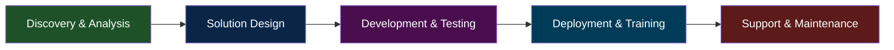

<div align="center">

<!-- Enhanced Dynamic Header -->


<!-- Enhanced Greeting Animation -->


<!-- Enhanced Social Links -->
<p align="center">
  <a href="https://www.linkedin.com/in/ibrahim-mahmoud-ibrahim" target="_blank">
    
  </a>
  <a href="mailto:ibrahimelmasry631@gmail.com">
    
  </a>
  <a href="https://github.com/Elmasry-631" target="_blank">
    
  </a>
  <a href="https://wa.me/201000000000" target="_blank">
    
  </a>
</p>

<!-- Profile Views -->


</div>

---

<!-- Enhanced Achievement Banner -->
<div align="center">

<h3>🏆 Impact Metrics & Achievements</h3>

<table>
<tr>
<td align="center">


<br/>
<b>Projects Delivered</b>

</td>
<td align="center">


<br/>
<b>Regional Coverage</b>

</td>
<td align="center">


<br/>
<b>Industry Diversity</b>

</td>
<td align="center">


<br/>
<b>Efficiency Gains</b>

</td>
</tr>
</table>

<!-- New Badges Row -->
<table>
<tr>
<td align="center">


<br/>
<b>Client Satisfaction</b>

</td>
<td align="center">


<br/>
<b>Support Availability</b>

</td>
<td align="center">


<br/>
<b>Certification Level</b>

</td>
<td align="center">


<br/>
<b>Years of Experience</b>

</td>
</tr>
</table>

</div>

---

<!-- Enhanced About Section -->
<div align="center">

###  <samp>def <span style="color:#00D9FF;">about_me</span>():</samp>

```python
class IbrahimElmasry:
    """
    ╔══════════════════════════════════════════════════════════════╗
    ║  Senior Odoo Developer & ERP Architect                      ║
    ║  Specializing in End-to-End Business Automation Solutions   ║
    ║  Across MENA Region with Proven Track Record                ║
    ╚══════════════════════════════════════════════════════════════╝
    """
    
    def __init__(self):
        self.name = "Ibrahim Elmasry"
        self.title = "Senior Odoo Developer | ERP Architect | Business Automation Expert"
        self.experience_years = "5+ Years"
        self.projects_delivered = "54+"
        self.countries_served = ["Egypt", "UAE", "Saudi Arabia", "Qatar", "Jordan", "Iraq"]
        self.client_retention_rate = "99%"
        
    def get_expertise(self):
        return {
            "Core Technologies": ["Odoo 15/16/17/18/19", "Python 3.x", "Django", "FastAPI", "PostgreSQL"],
            "Odoo Development": ["Custom Modules", "API Integration", "QWeb Reports", "Workflow Automation", "Point of Sale"],
            "Business Solutions": ["Full ERP Implementation", "Process Optimization", "Data Migration", "Multi-company Setup"],
            "Regional Expertise": ["MENA Market Specialist", "Multi-currency", "Arabic/English Bilingual", "Local Compliance"]
        }
    
    def get_specializations(self):
        return [
            "🏛️ Non-Profit Organizations & Foundations",
            "📚 Retail Chains & Bookstore Management",
            "🏭 Manufacturing & Factory Automation",
            "🏗️ Construction & Contracting",
            "🍽️ Restaurant & Hospitality",
            "💊 Healthcare & Pharmaceuticals",
            "⚖️ Legal & Professional Services",
            "🛒 E-commerce Integration"
        ]
    
    def contact(self):
        return {
            "email": "ibrahimelmasry631@gmail.com",
            "linkedin": "linkedin.com/in/ibrahim-mahmoud-ibrahim",
            "location": "Cairo, Egypt (Serving MENA)"
        }
```

</div>

---

<!-- Enhanced Value Proposition -->
<div align="center">

### 💡 Why Clients Choose Me

<table>
<tr>
<td width="50%" align="center">

#### 🎯 Problem-Solving Approach
- **Deep Analysis** → Understanding unique business needs before coding
- **Scalable Solutions** → Built to grow with your business
- **Best Practices** → Clean, maintainable, documented code
- **Future-Proof** → Easy upgrades and modifications

</td>
<td width="50%" align="center">

#### 🤝 Partnership Model
- **Free Consultation** → Initial assessment at no cost
- **Transparent Pricing** → No hidden fees, clear milestones
- **Training Included** → Empower your team to use the system
- **Ongoing Support** → Post-delivery maintenance available

</td>
</tr>
</table>

</div>

---

<!-- Geographic Reach -->
<div align="center">

###  🌍 Geographic Footprint & Market Presence

</div>

<div align="center">

| **🇪🇬 Egypt** | **🇸🇦 Saudi Arabia** | **🇦🇪 UAE** | **🇶🇦 Qatar** | **🇯🇴 Jordan** | **🇮🇶 Iraq** |
|:------------:|:-----------:|:-------------------:|:------------:|:---------:|:-------:|
| **Primary Base** | **Major Market** | Dubai & RAK | Doha Region | Amman | Baghdad |
| Strategic Hub | Largest Client Base | Growing Presence | Established | Expansion | Active |
|  |  |  |  |  |  |

</div>

---

<!-- Complete Client Portfolio - ENHANCED WITH NEW PROJECTS -->
<div align="center">

###  📋 Complete Client Portfolio (54 Projects)

</div>

<div align="center">

| # | Client | Industry | Country | # | Client | Industry | Country |
|:---:|:-------|:---------|:-------:|:---:|:-------|:---------|:-------:|
| 1 | Flexible Service for General Contracting | Construction & Contracting | 🇸🇦 SA | 28 | Grove Restaurant | Food & Restaurants | 🇸🇦 SA |
| 2 | Monish | Food & Restaurants | 🇸🇦 SA | 29 | Palazzo Ballroom | Hospitality & Events | 🇸🇦 SA |
| 3 | Dam Construction LLC | Construction & Contracting | 🇦🇪 AE | 30 | Holy Restaurant | Food & Restaurants | 🇸🇦 SA |
| 4 | Protect Ever | Healthcare | 🇪🇬 EG | 31 | Saud Al-Turaif Establishment | Construction & Contracting | 🇸🇦 SA |
| 5 | House Covers Industries | Home & Living | 🇪🇬 EG | 32 | Islamic Bank Restaurant | Food & Restaurants | 🇸🇦 SA |
| 6 | Bonanza RAK | Petroleum & Industrial | 🇦🇪 AE | 33 | Al Muttahida Cotton Factory | Manufacturing | 🇸🇦 SA |
| 7 | ILaw (UAE) | Legal & Professional | 🇦🇪 AE | 34 | Al Najmah Restaurant | Food & Restaurants | 🇸🇦 SA |
| 8 | Rose Palace | Hospitality & Events | 🇸🇦 SA | 35 | Ashal Hujuzat | Hospitality & Events | 🇸🇦 SA |
| 9 | Kholoud Al-Saadawi Factory | Manufacturing | 🇸🇦 SA | 36 | Titan X | Sports | 🇶🇦 QA |
| 10 | The Qaed Quality Leader | Legal & Professional | 🇸🇦 SA | 37 | Advanced Care | Healthcare | 🇶🇦 QA |
| 11 | Galal Rahem Ben Abdelrahim Elmaghraby | Food & Restaurants | 🇸🇦 SA | 38 | Al Zhbya International | Fashion & Marketing | 🇶🇦 QA |
| 12 | Neo Ship | Technology | 🇶🇦 QA | 39 | Amber | Trading & Retail | 🇶🇦 QA |
| 13 | Romeya for Marketing | Fashion & Marketing | 🇶🇦 QA | 40 | Golden Market for Trading | Trading & Retail | 🇪🇬 EG |
| 14 | Perla | Trading & Retail | 🇶🇦 QA | 41 | Pure Supplies | Trading & Retail | 🇪🇬 EG |
| 15 | Qatar Modern Factory for Tyres | Manufacturing | 🇶🇦 QA | 42 | Chicken I Land Restaurant | Food & Restaurants | 🇪🇬 EG |
| 16 | Dalton | Trading & Retail | 🇪🇬 EG | 43 | TOYOU Company | Finance & Investment | 🇪🇬 EG |
| 17 | Royal Star for Plastic Industry | Manufacturing | 🇪🇬 EG | 44 | Vera Fashion | Fashion & Marketing | 🇮🇶 IQ |
| 18 | Hummer Furniture Factory | Manufacturing | 🇪🇬 EG | 45 | Innovadigits | Technology | 🇪🇬 EG |
| 19 | Qasr Almariyah | Real Estate & Tourism | 🇮🇶 IQ | 46 | Diamond Supply | Trading & Retail | 🇸🇦 SA |
| 20 | Trie Oxygen (Dubai) | Manufacturing | 🇦🇪 AE | 47 | Mid Core Farma | Pharmaceuticals | 🇪🇬 EG |
| 21 | Soltan Elabtekar | Trading & Retail | 🇪🇬 EG | 48 | Reach World | Real Estate & Tourism | 🇯🇴 JO |
| 22 | Traid Paint | Petroleum & Industrial | 🇪🇬 EG | 49 | Sarwa Life | Insurance | 🇪🇬 EG |
| 23 | Magawish Petroleum Company | Petroleum & Industrial | 🇪🇬 EG | 50 | Sarwa Insurance | Insurance | 🇪🇬 EG |
| 24 | Haitara | Construction & Contracting | 🇶🇦 QA | 51 | Katra | Manufacturing | 🇸🇦 SA |
| 25 | Alaz for Food Industry | Petroleum & Industrial | 🇪🇬 EG | 52 | Al-Tawreed Al-Masi | Trading & Retail | 🇸🇦 SA |
| 26 | Izdehar | Petroleum & Industrial | 🇸🇦 SA | 53 | Panda Retail | Trading & Retail | 🇪🇬 EG |
| 27 | Mohammed Bin Ahmed Al-Jumaih Foundation | Non-Profit Foundation | 🇸🇦 SA | 54 | Adlas | Libraries & Bookstores | 🇸🇦 SA |

</div>

---

<!-- New Section: Featured Projects -->
<div align="center">

### ⭐ Featured Implementations

<table>
<tr>
<td width="33%" align="center">

#### 🏛️ Non-Profit Excellence
**Mohammed Al-Jumaih Foundation**
<br/>


<br/>
<sub>Donation management, volunteer coordination, financial tracking</sub>

</td>
<td width="33%" align="center">

#### 📚 Retail Innovation
**Adlas Libraries**
<br/>


<br/>
<sub>Inventory management, multi-branch POS, supplier integration</sub>

</td>
<td width="33%" align="center">

#### 🏭 Manufacturing Power
**Royal Star Plastic Industry**
<br/>


<br/>
<sub>Production planning, quality control, BOM management</sub>

</td>
</tr>
</table>

</div>

---

<!-- Enhanced Tech Stack -->
<div align="center">

###  🛠️ Technical Arsenal

</div>

<table align="center">
<tr>
<th>Programming Languages</th>
<th>Frameworks & ERP</th>
<th>Databases & Caching</th>
<th>DevOps & Tools</th>
</tr>
<tr>
<td align="center">


</td>
<td align="center">


</td>
<td align="center">


</td>
<td align="center">


</td>
</tr>
</table>

<div align="center">

<!-- Specialized Skills - Enhanced -->
<table>
<tr>
<td align="center">


</td>
</tr>
<tr>
<td align="center">


</td>
</tr>
</table>

</div>

---

<!-- New Section: Development Workflow -->
<div align="center">

### 🔧 My Development Process


```mermaid
flowchart LR
    A[Discovery & Analysis] --> B[Solution Design]
    B --> C[Development & Testing]
    C --> D[Deployment & Training]
    D --> E[Support & Maintenance]
    
    style A fill:#1E5128,color:#fff
    style B fill:#0A2647,color:#fff
    style C fill:#4A0E4E,color:#fff
    style D fill:#003C58,color:#fff
    style E fill:#5C1A1A,color:#fff
```

</div>

---

<!-- What I Deliver - Enhanced -->
<div align="center">

###  🚀 Comprehensive Service Offering

</div>

<div align="center">

| **Odoo Implementation** | **Custom Development** | **Integrations** | **Data Migration** |
|:--------------------------|:-------------------------|:--------------------|:---------------------|
| Full-cycle ERP deployment | Custom modules & apps | Payment gateways | Legacy system data |
| Module configuration | Workflow automation | Third-party APIs | Data cleansing |
| User training & docs | Report customization | E-commerce platforms | Validation & testing |
| Go-live support | UI/UX enhancements | SMS/Email services | Post-migration audit |

| **Process Automation** | **Support & Maintenance** | **Multi-company Setup** | **POS Solutions** |
|:-------------------------|:----------------------------|:--------------------------|:--------------------|
| Workflow optimization | Bug fixes & patches | Multi-branch management | Hardware integration |
| Approval workflows | Performance optimization | Inter-company transactions | Offline capability |
| Notification systems | Version upgrades | Consolidated reporting | Receipt customization |
| Automated reporting | Security updates | Currency management | Kitchen display |

</div>

---

<!-- New Section: Testimonials Placeholder -->
<div align="center">

### 💬 Client Testimonials

<blockquote>
<i>"Ibrahim transformed our entire operation. His understanding of the Saudi market and Od expertise saved us months of development time."</i>
<br/>
<b>— CEO, Major Saudi Retail Chain</b>
</blockquote>

<blockquote>
<i>"Professional, responsive, and delivers quality work on time. Highly recommended for any Odoo project."</i>
<br/>
<b>— IT Director, UAE Construction Company</b>
</blockquote>

</div>

---

<!-- GitHub Stats - Enhanced -->
<div align="center">

###  📊 GitHub Activity & Contributions


</div>

---

<!-- Trophies -->
<div align="center">


</div>

---

<!-- New Section: Current Focus -->
<div align="center">

### 🎯 Currently Focusing On

<table>
<tr>
<td align="center">

#### 📈 Odoo 18/19 Migration
Helping businesses upgrade to latest versions with zero downtime

</td>
<td align="center">

#### 🤖 AI Integration
Exploring AI-powered features within Odoo ecosystem

</td>
<td align="center">

#### 🌐 SaaS Solutions
Building scalable multi-tenant Odoo solutions

</td>
</tr>
</table>

</div>

---

<!-- Enhanced CTA Section -->
<div align="center">

###  🤝 Ready to Transform Your Business?

<p align="center">
  <i>Let's discuss how Odoo can streamline your operations, automate your workflows, and drive sustainable growth.</i>
</p>
<p align="center">
  <b>Free initial consultation • Custom solutions • Ongoing support</b>
</p>

<table>
<tr>
<td align="center">

<a href="mailto:ibrahimelmasry631@gmail.com">
  
</a>

</td>
<td align="center">

<a href="https://www.linkedin.com/in/ibrahim-mahmoud-ibrahim" target="_blank">
  
</a>

</td>
<td align="center">

<a href="https://github.com/Elmasry-631" target="_blank">
  
</a>

</td>
</tr>
</table>

<!-- Quote -->


</div>

<!-- Footer -->


<div align="center">

<p><sub>Made with ❤️ by Ibrahim Elmasry | Last Updated: 2025</sub></p>

</div>
