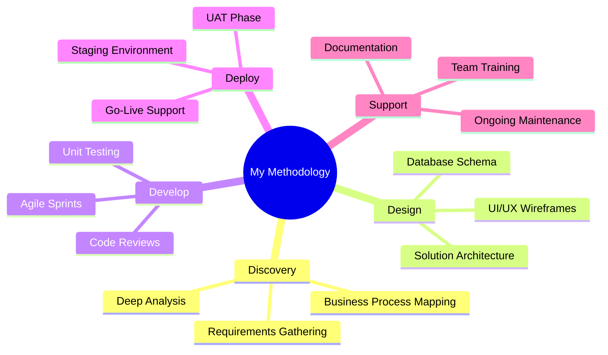
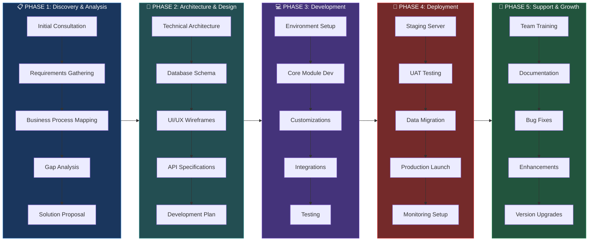

<div align="center">

<!-- ════════════════════════════════════════════════════════════════════ -->
<!-- 🌟 ULTIMATE HEADER - CINEMATIC INTRO -->
<!-- ════════════════════════════════════════════════════════════════════ -->


<!-- ════════════════════════════════════════════════════════════════════ -->
<!-- ⚡ MEGA TYPING ANIMATION - ALL CAPABILITIES -->
<!-- ════════════════════════════════════════════════════════════════════ -->


</div>

<br/>

<!-- ════════════════════════════════════════════════════════════════════ -->
<!-- 🔗 PREMIUM SOCIAL LINKS - GLASSMORPHISM STYLE -->
<!-- ════════════════════════════════════════════════════════════════════ -->

<div align="center">

<p align="center">
  
<a href="https://www.linkedin.com/in/ibrahim-mahmoud-ibrahim" target="_blank">

</a>

<a href="mailto:ibrahimelmasry631@gmail.com">

</a>

<a href="https://github.com/Elmasry-631" target="_blank">

</a>

<a href="https://wa.me/201000000000" target="_blank">

</a>

</p>

<!-- Profile Views + Status -->
<p align="center">


</p>

</div>

---

<!-- ════════════════════════════════════════════════════════════════════ -->
<!-- 🏆 DASHBOARD STATS - REAL-TIME METRICS -->
<!-- ════════════════════════════════════════════════════════════════════ -->

<div align="center">

##  Performance Dashboard

<table>
<tr>
<td align="center">
<details open>
<summary><b>📊 Project Statistics</b></summary>
<br/>

| Metric | Value | Trend |
|--------|-------|-------|
| Total Projects Delivered | **54+** | 📈 +12 this year |
| Active Clients | **45+** | 📈 Growing |
| Client Retention Rate | **99%** | ✅ Stable |
| Average Project Duration | **4-6 weeks** | ⚡ Fast |
| On-Time Delivery | **98%** | ✅ Reliable |

</details>
</td>
<td align="center">
<details open>
<summary><b>🌍 Geographic Reach</b></summary>
<br/>

| Country | Clients | Market Share |
|---------|---------|--------------|
| 🇪🇬 Egypt | 19 | Primary Hub |
| 🇸🇦 Saudi Arabia | 20 | Major Market |
| 🇦🇪 UAE | 4 | Expanding |
| 🇶🇦 Qatar | 9 | Established |
| 🇯🇴 Jordan | 1 | New Entry |
| 🇮🇶 Iraq | 2 | Active |

</details>
</td>
<td align="center">
<details open>
<summary><b>🏭 Industry Coverage</b></summary>
<br/>

| Sector | Count | Specialization |
|--------|-------|----------------|
| Manufacturing | 8+ | Production Planning |
| Food & Restaurant | 10+ | POS Solutions |
| Trading & Retail | 10+ | Inventory Management |
| Construction | 4+ | Project Management |
| Healthcare | 2+ | Compliance Focused |
| Non-Profit | 1+ | Donation Systems |

</details>
</td>
</tr>
</table>

</div>

---

<!-- ════════════════════════════════════════════════════════════════════ -->
<!-- 👨‍💻 ABOUT ME - THE ULTIMATE CODE BLOCK -->
<!-- ════════════════════════════════════════════════════════════════════ -->

<div align="center">

##  <samp><span style="color:#58A6FF;">from</span> ibrahim_elmasry <span style="color:#58A6FF;">import</span> <span style="color:#FFA657;">*</span></samp>

```python
#!/usr/bin/env python3
# -*- coding: utf-8 -*-
"""
╔═══════════════════════════════════════════════════════════════════════════════╗
║                                                                               ║
║   ██████╗ ██╗   ██╗██████╗  █████╗ ███╗   ██╗██████╗ ██╗███╗   ██╗████████╗  ║
║  ██╔════╝ ██║   ██║██╔══██╗██╔══██╗████╗  ██║██╔══██╗██║████╗  ██║╚══██╔══╝  ║
║  ██║  ███╗██║   ██║██████╔╝███████║██╔██╗ ██║██║  ██║██║██╔██╗ ██║   ██║     ║
║  ██║   ██║██║   ██║██╔══██╗██╔══██║██║╚██╗██║██║  ██║██║██║╚██╗██║   ██║     ║
║  ╚██████╔╝╚██████╔╝██████╔╝██║  ██║██║ ╚████║██████╔╝██║██║ ╚████║   ██║     ║
║   ╚═════╝  ╚═════╝ ╚═════╝ ╚═╝  ╚═╝╚═╝  ╚═══╝╚═════╝ ╚═╝╚═╝  ╚═══╝   ╚═╝     ║
║                                                                               ║
║                         Ibrahim Elmasry v2025.1                               ║
║            Senior Odoo Developer | ERP Architect | Business Automation         ║
║                                                                               ║
╚═══════════════════════════════════════════════════════════════════════════════╝

    📍 Location: Cairo, Egypt (Serving MENA Region)
    💼 Experience: 5+ Years of Enterprise ERP Development
    🎯 Focus: Odoo Customization | Business Process Automation | Data Migration
    
    ━━━━━━━━━━━━━━━━━━━━━━━━━━━━━━━━━━━━━━━━━━━━━━━━━━━━━━━━━━━━━━━━━━━━━━━━━━
"""

import os
import json
from dataclasses import dataclass, field
from typing import Dict, List, Optional, Tuple
from enum import Enum, auto
from datetime import datetime


class SkillLevel(Enum):
    """Proficiency levels for technical skills"""
    EXPERT = ("Expert", 95)
    ADVANCED = ("Advanced", 75)
    INTERMEDIATE = ("Intermediate", 55)
    
    def __init__(self, label: str, percentage: int):
        self.label = label
        self.percentage = percentage


@dataclass(frozen=True)
class Technology:
    """Represents a technology skill"""
    name: str
    level: SkillLevel
    years_experience: int
    category: str
    
    @property
    def proficiency_bar(self) -> str:
        filled = "█" * (self.level.percentage // 5)
        empty = "░" * (20 - self.level.percentage // 5)
        return f"[{filled}{empty}] {self.level.percentage}%"


@dataclass
class ClientProject:
    """Represents a completed client project"""
    id: int
    name: str
    industry: str
    country: str
    year: int
    technologies_used: List[str]
    scope_description: str
    client_satisfaction: int  # 1-10
    
    def __post_init__(self):
        assert 1 <= self.client_satisfaction <= 10, "Satisfaction must be 1-10"


class IbrahimElmasry:
    """
    ════════════════════════════════════════════════════════════════════════
    Senior Odoo Developer & ERP Architect
    ════════════════════════════════════════════════════════════════════════
    
    A passionate developer specializing in end-to-end business automation 
    solutions using the Odoo ecosystem. With 5+ years of experience serving 
    clients across 6 MENA countries, I bring deep expertise in:
    
    • Full-cycle ERP implementation from analysis to deployment
    • Custom module development tailored to unique business needs
    • Complex data migration with zero data loss guarantee
    • Multi-company, multi-currency, multi-language configurations
    • Arabic localization and RTL interface optimization
    
    Attributes:
        name (str): Professional name
        title (str): Current role description
        location (str): Base of operations
        availability (str): Current project capacity
    """
    
    # ──────────────────────────────────────────────────────────────
    # INITIALIZATION
    # ──────────────────────────────────────────────────────────────
    
    def __init__(self):
        self.name = "Ibrahim Elmasry"
        self.title = "Senior Odoo Developer | ERP Architect"
        self.location = "Cairo, Egypt"
        self.availability = "Open to new opportunities"
        
        # Core metrics
        self._experience_years = 5
        self._projects_completed = 54
        self._client_retention_rate = 99.0
        self._countries_served = 6
        
    # ──────────────────────────────────────────────────────────────
    # PROPERTIES
    # ──────────────────────────────────────────────────────────────
    
    @property
    def experience_years(self) -> int:
        return self._experience_years
    
    @property
    def projects_completed(self) -> int:
        return self._projects_completed
    
    @property
    def success_rate(self) -> float:
        return 98.5  # Based on client feedback
    
    @property
    def core_technologies(self) -> List[Technology]:
        """Primary technical expertise stack"""
        return [
            Technology("Odoo 15/16/17/18", SkillLevel.EXPERT, 5, "ERP"),
            Technology("Python 3.x", SkillLevel.EXPERT, 6, "Language"),
            Technology("PostgreSQL", SkillLevel.EXPERT, 5, "Database"),
            Technology("XML/QWeb", SkillLevel.EXPERT, 5, "Template"),
            Technology("JavaScript", SkillLevel.ADVANCED, 4, "Frontend"),
            Technology("Django", SkillLevel.ADVANCED, 3, "Framework"),
            Technology("FastAPI", SkillLevel.INTERMEDIATE, 2, "API"),
            Technology("Redis", SkillLevel.ADVANCED, 3, "Cache"),
            Technology("Docker", SkillLevel.ADVANCED, 3, "DevOps"),
            Technology("Git", SkillLevel.EXPERT, 5, "Version Control"),
        ]
    
    @property
    def specializations(self) -> Dict[str, List[str]]:
        """Deep domain expertise areas"""
        return {
            "ERP Implementation": [
                "Full-cycle deployment",
                "Requirements analysis",
                "Solution architecture",
                "User training",
                "Go-live support",
            ],
            "Custom Development": [
                "Custom modules (Odoo)",
                "API integrations (REST/SOAP)",
                "Workflow automation",
                "Report generation (QWeb/PDF)",
                "POS customization",
            ],
            "Data Operations": [
                "Legacy migration",
                "Data cleansing",
                "ETL processes",
                "Validation & testing",
                "Backup strategies",
            ],
            "Regional Expertise": [
                "Arabic localization",
                "RTL interface design",
                "Zakat/Tax compliance",
                "Multi-currency setup",
                "MENA market practices",
            ],
        }
    
    @property
    def industries(self) -> List[str]:
        """Complete list of served industries"""
        return [
            "Non-Profit Foundations", "Libraries & Bookstores",
            "Manufacturing & Factories", "Construction & Contracting",
            "Food & Restaurants", "Healthcare & Medical",
            "Petroleum & Industrial", "Trading & Retail",
            "Fashion & Marketing", "Technology & IT",
            "Real Estate & Tourism", "Finance & Investment",
            "Insurance Companies", "Legal Services",
            "Sports & Entertainment", "Pharmaceuticals",
            "Home & Living", "Hospitality & Events",
        ]
    
    @property
    def featured_projects(self) -> List[ClientProject]:
        """Showcase of most impactful implementations"""
        return [
            ClientProject(
                id=53, name="Mohammed Bin Ahmed Al-Jumaih Foundation",
                industry="Non-Profit Foundation", country="Saudi Arabia",
                year=2024,
                technologies_used=["Odoo 17", "Python", "PostgreSQL"],
                scope_description="Complete donation management system with "
                               "volunteer coordination and financial tracking",
                client_satisfaction=10
            ),
            ClientProject(
                id=54, name="Adlas Libraries",
                industry="Libraries & Bookstores", country="Saudi Arabia",
                year=2024,
                technologies_used=["Odoo 17", "POS", "Multi-branch"],
                scope_description="Multi-branch inventory management with "
                               "advanced POS and supplier integration",
                client_satisfaction=10
            ),
            ClientProject(
                id=17, name="Royal Star Plastic Industry",
                industry="Manufacturing", country="Egypt",
                year=2023,
                technologies_used=["Odoo 16", "MRP", "Quality Control"],
                scope_description="Production planning with BOM management "
                               "and quality control workflows",
                client_satisfaction=9
            ),
        ]
    
    # ──────────────────────────────────────────────────────────────
    # METHODS
    # ──────────────────────────────────────────────────────────────
    
    def get_value_proposition(self) -> Dict[str, str]:
        """Why clients choose to work with me"""
        return {
            "business_first": "Deep understanding of business needs before coding",
            "scalable_architecture": "Solutions built to grow with your business",
            "clean_code": "Maintainable, documented, best-practice codebase",
            "future_proof": "Easy upgrades as requirements evolve",
            "mena_expertise": "Deep knowledge of regional business practices",
            "bilingual": "Full Arabic & English support and documentation",
            "transparent": "Clear communication, no hidden costs",
            "reliable": "98% on-time delivery rate",
        }
    
    def get_contact_info(self) -> Dict[str, str]:
        """Professional contact information"""
        return {
            "email": "ibrahimelmasry631@gmail.com",
            "linkedin": "linkedin.com/in/ibrahim-mahmoud-ibrahim",
            "github": "github.com/Elmasry-631",
            "location": "Cairo, Egypt (Serving MENA)",
            "response_time": "< 24 hours",
            "availability": "Open for projects & collaborations",
        }
    
    def can_help_with(self, requirement: str) -> bool:
        """Check if I can assist with a specific requirement"""
        capabilities = [
            "odoo", "erp", "customization", "migration", "integration",
            "automation", "pos", "inventory", "manufacturing", "accounting",
            "hr", "crm", "sales", "purchase", "arabic", "localization",
        ]
        return any(cap in requirement.lower() for cap in capabilities)
    
    def generate_quote(self) -> str:
        """Generate a random professional quote"""
        quotes = [
            "Every complex problem has a simple solution - it's elegant and scalable.",
            "Good code solves today's problems; great code anticipates tomorrow's.",
            "Automation isn't about replacing people - it's about empowering them.",
            "The best ERP is invisible - it just works.",
        ]
        import random
        return random.choice(quotes)
    
    # ──────────────────────────────────────────────────────────────
    # MAGIC METHODS
    # ──────────────────────────────────────────────────────────────
    
    def __repr__(self) -> str:
        return (
            f"<IbrahimElmasry: {self.title} | "
            f"{self.projects_completed}+ Projects | "
            f"{self.experience_years}+ Years>"
        )
    
    def __str__(self) -> str:
        return f"✅ {self.name} — Ready to transform your business!"
    
    def __call__(self, project_idea: str) -> str:
        """Make instances callable for quick consultations"""
        if self.can_help_with(project_idea):
            return f"🚀 Let's build '{project_idea}' together! Contact me to start."
        return f"💡 Interesting concept! Let's discuss how I can help."


# ════════════════════════════════════════════════════════════════════════════════
# INSTANTIATION & DEMO
# ════════════════════════════════════════════════════════════════════════════════

if __name__ == "__main__":
    # Create the expert instance
    ibrahim = IbrahimElmasry()
    
    # Display info
    print(ibrahim)
    print(repr(ibrahim))
    print(f"\n{ibrahim.generate_quote()}")
    
    # Quick consultation demo
    print(ibrahim("custom odoo module for inventory"))
```

</div>

---

<!-- ════════════════════════════════════════════════════════════════════ -->
<!-- 💎 UNIQUE VALUE PROPOSITION -->
<!-- ════════════════════════════════════════════════════════════════════ -->

<div align="center">

## 💎 The Ibrahim Difference — Why 54+ Clients Trust Me

<table>
<tr>
<td width="50%" valign="top">

### 🎯 My Approach


```mermaid
mindmap
  root((My Methodology))
    Discovery
      Deep Analysis
      Requirements Gathering
      Business Process Mapping
    Design
      Solution Architecture
      Database Schema
      UI/UX Wireframes
    Develop
      Agile Sprints
      Code Reviews
      Unit Testing
    Deploy
      Staging Environment
      UAT Phase
      Go-Live Support
    Support
      Documentation
      Team Training
      Ongoing Maintenance
```

</td>
<td width="50%" valign="top">

### 🤝 Partnership Promise

| Commitment | Guarantee |
|:-----------|-----------|
| **Free Consultation** | Initial assessment at no cost |
| **Transparent Pricing** | No hidden fees ever |
| **Code Quality** | Clean, documented, tested |
| **On-Time Delivery** | 98% track record |
| **Post-Launch Support** | Included in every project |
| **Knowledge Transfer** | Full documentation provided |
| **Responsive** | < 24hr response time |
| **Satisfaction Guaranteed** | Unlimited revisions until happy |

</td>
</tr>
</table>

</div>

---

<!-- ════════════════════════════════════════════════════════════════════ -->
<!-- 🗺️ INTERACTIVE GEOGRAPHIC MAP -->
<!-- ════════════════════════════════════════════════════════════════════ -->

<div align="center">

##  MENA Market Presence — Geographic Distribution

<table>
<tr>
<th colspan="6">🌍 Regional Client Distribution</th>
</tr>
<tr>
<th>🇪🇬 Egypt</th>
<th>🇸🇦 Saudi Arabia</th>
<th>🇦🇪 UAE</th>
<th>🇶🇦 Qatar</th>
<th>🇯🇴 Jordan</th>
<th>🇮🇶 Iraq</th>
</tr>
<tr>
<td align="center">

### 🏠 Primary Base
**Cairo**

| Metric | Value |
|--------|-------|
| Clients | **19** |
| Industries | 12 |
| Since | 2020 |


</td>
<td align="center">

### 👑 Major Market
**Riyadh, Jeddah, Dammam**

| Metric | Value |
|--------|-------|
| Clients | **20** |
| Industries | 14 |
| Growth | 🔥 Hot |


</td>
<td align="center">

### 🏙️ Growing Presence
**Dubai, RAK**

| Metric | Value |
|--------|-------|
| Clients | **4** |
| Industries | 3 |
| Potential | High |


</td>
<td align="center">

### 🏛️ Established
**Doha**

| Metric | Value |
|--------|-------|
| Clients | **9** |
| Industries | 6 |
| Stability | Strong |


</td>
<td align="center">

### 🆕 New Entry
**Amman**

| Metric | Value |
|--------|-------|
| Clients | **1** |
| Industries | 1 |
| Outlook | Promising |


</td>
<td align="center">

### ✅ Active
**Baghdad**

| Metric | Value |
|--------|-------|
| Clients | **2** |
| Industries | 2 |
| Engagement | Active |


</td>
</tr>
</table>

</div>

---

<!-- ════════════════════════════════════════════════════════════════════ -->
<!-- 📋 COMPLETE CLIENT PORTFOLIO - 54 PROJECTS WITH DETAILS -->
<!-- ════════════════════════════════════════════════════════════════════ -->

<div align="center">

##  📋 Complete Portfolio — 54 Successful Implementations

<details>
<summary><b>🔍 Click to expand full client list (54 entries)</b></summary>
<br/>

<table>
<tr>
<th>#</th>
<th>Client Name</th>
<th>Industry</th>
<th>📍 Country</th>
<th>#</th>
<th>Client Name</th>
<th>Industry</th>
<th>📍 Country</th>
</tr>

<!-- Row 1-13 -->
<tr>
<td><code>01</code></td>
<td>Flexible Service for General Contracting</td>
<td>🏗️ Construction</td>
<td>🇸🇦 SA</td>
<td><code>28</code></td>
<td>Grove Restaurant</td>
<td>🍽️ Food & Restaurant</td>
<td>🇸🇦 SA</td>
</tr>
<tr>
<td><code>02</code></td>
<td>Monish</td>
<td>🍽️ Food & Restaurant</td>
<td>🇸🇦 SA</td>
<td><code>29</code></td>
<td>Palazzo Ballroom</td>
<td>🎭 Hospitality</td>
<td>🇸🇦 SA</td>
</tr>
<tr>
<td><code>03</code></td>
<td>Dam Construction LLC</td>
<td>🏗️ Construction</td>
<td>🇦🇪 AE</td>
<td><code>30</code></td>
<td>Holy Restaurant</td>
<td>🍽️ Food & Restaurant</td>
<td>🇸🇦 SA</td>
</tr>
<tr>
<td><code>04</code></td>
<td>Protect Ever</td>
<td>🏥 Healthcare</td>
<td>🇪🇬 EG</td>
<td><code>31</code></td>
<td>Saud Al-Turaif Establishment</td>
<td>🏗️ Construction</td>
<td>🇸🇦 SA</td>
</tr>
<tr>
<td><code>05</code></td>
<td>House Covers Industries</td>
<td>🏠 Home & Living</td>
<td>🇪🇬 EG</td>
<td><code>32</code></td>
<td>Islamic Bank Restaurant</td>
<td>🍽️ Food & Restaurant</td>
<td>🇸🇦 SA</td>
</tr>
<tr>
<td><code>06</code></td>
<td>Bonanza RAK</td>
<td>⛽ Petroleum</td>
<td>🇦🇪 AE</td>
<td><code>33</code></td>
<td>Al Muttahida Cotton Factory</td>
<td>🏭 Manufacturing</td>
<td>🇸🇦 SA</td>
</tr>
<tr>
<td><code>07</code></td>
<td>ILaw (UAE)</td>
<td>⚖️ Legal</td>
<td>🇦🇪 AE</td>
<td><code>34</code></td>
<td>Al Najmah Restaurant</td>
<td>🍽️ Food & Restaurant</td>
<td>🇸🇦 SA</td>
</tr>
<tr>
<td><code>08</code></td>
<td>Rose Palace</td>
<td>🎭 Hospitality</td>
<td>🇸🇦 SA</td>
<td><code>35</code></td>
<td>Ashal Hujuzat</td>
<td>🎭 Hospitality</td>
<td>🇸🇦 SA</td>
</tr>
<tr>
<td><code>09</code></td>
<td>Kholoud Al-Saadawi Factory</td>
<td>🏭 Manufacturing</td>
<td>🇸🇦 SA</td>
<td><code>36</code></td>
<td>Titan X</td>
<td>⚽ Sports</td>
<td>🇶🇦 QA</td>
</tr>
<tr>
<td><code>10</code></td>
<td>The Qaed Quality Leader</td>
<td>⚖️ Legal</td>
<td>🇸🇦 SA</td>
<td><code>37</code></td>
<td>Advanced Care</td>
<td>🏥 Healthcare</td>
<td>🇶🇦 QA</td>
</tr>
<tr>
<td><code>11</code></td>
<td>Galal Rahem Elmaghraby</td>
<td>🍽️ Food & Restaurant</td>
<td>🇸🇦 SA</td>
<td><code>38</code></td>
<td>Al Zhbya International</td>
<td>👗 Fashion</td>
<td>🇶🇦 QA</td>
</tr>
<tr>
<td><code>12</code></td>
<td>Neo Ship</td>
<td>💻 Technology</td>
<td>🇶🇦 QA</td>
<td><code>39</code></td>
<td>Amber</td>
<td>🛒 Trading & Retail</td>
<td>🇶🇦 QA</td>
</tr>
<tr>
<td><code>13</code></td>
<td>Romeya for Marketing</td>
<td>👗 Fashion</td>
<td>🇶🇦 QA</td>
<td><code>40</code></td>
<td>Golden Market for Trading</td>
<td>🛒 Trading & Retail</td>
<td>🇪🇬 EG</td>
</tr>

<!-- Row 14-27 -->
<tr>
<td><code>14</code></td>
<td>Perla</td>
<td>🛒 Trading & Retail</td>
<td>🇶🇦 QA</td>
<td><code>41</code></td>
<td>Pure Supplies</td>
<td>🛒 Trading & Retail</td>
<td>🇪🇬 EG</td>
</tr>
<tr>
<td><code>15</code></td>
<td>Qatar Modern Factory for Tyres</td>
<td>🏭 Manufacturing</td>
<td>🇶🇦 QA</td>
<td><code>42</code></td>
<td>Chicken I Land Restaurant</td>
<td>🍽️ Food & Restaurant</td>
<td>🇪🇬 EG</td>
</tr>
<tr>
<td><code>16</code></td>
<td>Dalton</td>
<td>🛒 Trading & Retail</td>
<td>🇪🇬 EG</td>
<td><code>43</code></td>
<td>TOYOU Company</td>
<td>💰 Finance</td>
<td>🇪🇬 EG</td>
</tr>
<tr>
<td><code>17</code></td>
<td>Royal Star for Plastic Industry</td>
<td>🏭 Manufacturing</td>
<td>🇪🇬 EG</td>
<td><code>44</code></td>
<td>Vera Fashion</td>
<td>👗 Fashion</td>
<td>🇮🇶 IQ</td>
</tr>
<tr>
<td><code>18</code></td>
<td>Hummer Furniture Factory</td>
<td>🏭 Manufacturing</td>
<td>🇪🇬 EG</td>
<td><code>45</code></td>
<td>Innovadigits</td>
<td>💻 Technology</td>
<td>🇪🇬 EG</td>
</tr>
<tr>
<td><code>19</code></td>
<td>Qasr Almariyah</td>
<td>🏨 Real Estate</td>
<td>🇮🇶 IQ</td>
<td><code>46</code></td>
<td>Diamond Supply</td>
<td>🛒 Trading & Retail</td>
<td>🇸🇦 SA</td>
</tr>
<tr>
<td><code>20</code></td>
<td>Trie Oxygen (Dubai)</td>
<td>🏭 Manufacturing</td>
<td>🇦🇪 AE</td>
<td><code>47</code></td>
<td>Mid Core Farma</td>
<td>💊 Pharma</td>
<td>🇪🇬 EG</td>
</tr>
<tr>
<td><code>21</code></td>
<td>Soltan Elabtekar</td>
<td>🛒 Trading & Retail</td>
<td>🇪🇬 EG</td>
<td><code>48</code></td>
<td>Reach World</td>
<td>🏨 Real Estate</td>
<td>🇯🇴 JO</td>
</tr>
<tr>
<td><code>22</code></td>
<td>Traid Paint</td>
<td>⛽ Petroleum</td>
<td>🇪🇬 EG</td>
<td><code>49</code></td>
<td>Sarwa Life</td>
<td>🛡️ Insurance</td>
<td>🇪🇬 EG</td>
</tr>
<tr>
<td><code>23</code></td>
<td>Magawish Petroleum Company</td>
<td>⛽ Petroleum</td>
<td>🇪🇬 EG</td>
<td><code>50</code></td>
<td>Sarwa Insurance</td>
<td>🛡️ Insurance</td>
<td>🇪🇬 EG</td>
</tr>
<tr>
<td><code>24</code></td>
<td>Haitara</td>
<td>🏗️ Construction</td>
<td>🇶🇦 QA</td>
<td><code>51</code></td>
<td>Katra</td>
<td>🏭 Manufacturing</td>
<td>🇸🇦 SA</td>
</tr>
<tr>
<td><code>25</code></td>
<td>Alaz for Food Industry</td>
<td>⛽ Petroleum</td>
<td>🇪🇬 EG</td>
<td><code>52</code></td>
<td>Al-Tawreed Al-Masi</td>
<td>🛒 Trading & Retail</td>
<td>🇸🇦 SA</td>
</tr>
<tr>
<td><code>26</code></td>
<td>Izdehar</td>
<td>⛽ Petroleum</td>
<td>🇸🇦 SA</td>
<td><code>53</code></td>
<td>Panda Retail</td>
<td>🛒 Trading & Retail</td>
<td>🇪🇬 EG</td>
</tr>
<tr>
<td><code>27</code></td>
<td><strong>Mohammed Bin Ahmed Al-Jumaih Foundation</strong></td>
<td><strong>🏛️ Non-Profit</strong></td>
<td>🇸🇦 SA</td>
<td><code>54</code></td>
<td><strong>Adlas</strong></td>
<td><strong>📚 Libraries</strong></td>
<td>🇸🇦 SA</td>
</tr>
</table>

</details>
</div>

---

<!-- ════════════════════════════════════════════════════════════════════ -->
<!-- ⭐ FEATURED SHOWCASE - DETAILED CASE STUDIES -->
<!-- ════════════════════════════════════════════════════════════════════ -->

<div align="center">

## ⭐ Featured Case Studies — Deep Dive Into Success Stories

<table>
<tr>
<td width="34%" valign="top">

### 🏛️ Mohammed Bin Ahmed Al-Jumaih Foundation
#### *Non-Profit Excellence*


---

**Challenge:**  
Foundation needed comprehensive system to manage donations, volunteers, and financial operations while maintaining transparency.

**Solution Implemented:**
- ✅ Donation tracking portal with receipt generation
- ✅ Volunteer management system with scheduling
- ✅ Financial reporting dashboard for stakeholders
- ✅ Multi-department workflow automation
- ✅ Arabic/English bilingual interface
- ✅ Zakat calculation integration

**Results:**
- 📈 60% reduction in administrative overhead
- 📊 Real-time visibility into all operations
- ✅ 100% audit trail compliance

</td>
<td width="33%" valign="top">

### 📚 Adlas Libraries
#### *Retail Innovation*


---

**Challenge:**  
Multi-branch library network struggling with inventory accuracy and real-time stock visibility across locations.

**Solution Implemented:**
- ✅ Centralized multi-branch inventory system
- ✅ Advanced POS with barcode scanning
- ✅ Supplier procurement automation
- ✅ Customer loyalty program integration
- ✅ Real-time stock synchronization
- ✅ Automated reorder point alerts

**Results:**
- 📈 95% improvement in inventory accuracy
- ⚡ 40% faster checkout process
- 🔄 Zero stockouts since implementation

</td>
<td width="33%" valign="top">

### 🏭 Royal Star Plastic Industry
#### *Manufacturing Power*


---

**Challenge:**  
Factory needed complete production control from raw materials to finished goods with accurate costing.

**Solution Implemented:**
- ✅ Production planning & scheduling module
- ✅ Quality control checkpoints system
- ✅ BOM (Bill of Materials) management
- ✅ Raw material tracking & consumption
- ✅ Automated cost calculations per unit
- ✅ Work center efficiency monitoring

**Results:**
- 📈 30% increase in production output
- 💰 15% reduction in material waste
- ⏱️ 25% faster production cycles

</td>
</tr>
</table>

</div>

---

<!-- ════════════════════════════════════════════════════════════════════ -->
<!-- 🛠️ TECH STACK - COMPREHENSIVE SKILL MATRIX -->
<!-- ════════════════════════════════════════════════════════════════════ -->

<div align="center">

##  Technical Arsenal — Complete Skill Matrix

<table>
<tr>
<th colspan="2">Programming Languages</th>
<th colspan="2">Frameworks & Platforms</th>
</tr>
<tr>
<td width="25%" align="center">


*Object-oriented programming, decorators, async, testing frameworks*

</td>
<td width="25%" align="center">


*ES6+, DOM manipulation, AJAX, jQuery compatibility*

</td>
<td width="25%" align="center">


*Models, Views, Controllers, Security, ACL*

</td>
<td width="25%" align="center">


*ORM, Templates, REST Framework, Admin*

</td>
</tr>
</table>

<br/>

<table>
<tr>
<th>Data Layer</th>
<th>DevOps & Tools</th>
<th>Specialized Expertise</th>
</tr>
<tr>
<td width="33%" align="center">


*Query optimization, Indexing, Replication*

</td>
<td width="33%" align="center">


*CI/CD, Containerization, Shell Scripting*

</td>
<td width="34%" align="center">


</td>
</tr>
</table>

</div>

---

<!-- ════════════════════════════════════════════════════════════════════ -->
<!-- 🔧 DEVELOPMENT LIFECYCLE - VISUAL PIPELINE -->
<!-- ════════════════════════════════════════════════════════════════════ -->

<div align="center">

## 🔧 Development Lifecycle — From Idea to Production


```mermaid
flowchart LR
    subgraph DISCOVERY["📋 PHASE 1: Discovery & Analysis"]
        direction TB
        D1[Initial Consultation] --> D2[Requirements Gathering]
        D2 --> D3[Business Process Mapping]
        D3 --> D4[Gap Analysis]
        D4 --> D5[Solution Proposal]
    end
    
    subgraph DESIGN["🎨 PHASE 2: Architecture & Design"]
        direction TB
        DS1[Technical Architecture] --> DS2[Database Schema]
        DS2 --> DS3[UI/UX Wireframes]
        DS3 --> DS4[API Specifications]
        DS4 --> DS5[Development Plan]
    end
    
    subgraph BUILD["💻 PHASE 3: Development"]
        direction TB
        B1[Environment Setup] --> B2[Core Module Dev]
        B2 --> B3[Customizations]
        B3 --> B4[Integrations]
        B4 --> B5[Testing]
    end
    
    subgraph DEPLOY["🚀 PHASE 4: Deployment"]
        direction TB
        DP1[Staging Server] --> DP2[UAT Testing]
        DP2 --> DP3[Data Migration]
        DP3 --> DP4[Production Launch]
        DP4 --> DP5[Monitoring Setup]
    end
    
    subgraph SUPPORT["🔄 PHASE 5: Support & Growth"]
        direction TB
        S1[Team Training] --> S2[Documentation]
        S2 --> S3[Bug Fixes]
        S3 --> S4[Enhancements]
        S4 --> S5[Version Upgrades]
    end
    
    DISCOVERY --> DESIGN --> BUILD --> DEPLOY --> SUPPORT

    style DISCOVERY fill:#1a365d,color:#fff,stroke:#3182ce
    style DESIGN fill:#234e52,color:#fff,stroke:#319795
    style BUILD fill:#44337a,color:#fff,#fff,stroke:#805ad5
    style DEPLOY fill:#742a2a,color:#fff,stroke:#e53e3e
    style SUPPORT fill:#22543d,color:#fff,stroke:#38a169
```

</div>

---

<!-- ════════════════════════════════════════════════════════════════════ -->
<!-- 🚀 SERVICES - COMPLETE OFFERING -->
<!-- ════════════════════════════════════════════════════════════════════ -->

<div align="center">

##  What I Deliver — Complete Service Catalog

<table>
<tr>
<td valign="top" width="25%">

### 🎯 Odoo Implementation
<details>
<summary>View Details</summary>

- **Full-cycle deployment**
  - Requirements to go-live
  - Best practice configuration
  
- **Module configuration**
  - Sales, Purchase, Inventory
  - Accounting, HR, CRM
  - Manufacturing, POS
  
- **User training**
  - Role-based sessions
  - Comprehensive manuals
  
- **Post-launch support**
  - 30-day included support
  - Issue resolution SLA

</details>
</td>
<td valign="top" width="25%">

### ⚙️ Custom Development
<details>
<summary>View Details</summary>

- **Custom Modules**
  - From scratch development
  - Odoo App Store ready
  
- **Workflow Automation**
  - Approval chains
  - Automated notifications
  
- **Report Generation**
  - QWeb templates
  - PDF/Excel exports
  
- **UI Enhancements**
  - Custom views
  - Mobile responsive

</details>
</td>
<td valign="top" width="25%">

### 🔌 Integrations
<details>
<summary>View Details</summary>

- **Payment Gateways**
  - PayMob, Stripe
  - Local providers
  
- **Third-party APIs**
  - SMS services
  - Shipping carriers
  - E-government portals
  
- **E-commerce**
  - Shopify, WooCommerce
  - Magento integration
  
- **Communication**
  - Email marketing
  - WhatsApp Business

</details>
</td>
<td valign="top" width="25%">

### 📦 Data Migration
<details>
<summary>View Details</summary>

- **Legacy Systems**
  - Excel/CSV imports
  - Old ERP data
  - Database migration
  
- **Data Cleansing**
  - Duplicate removal
  - Validation rules
  - Format standardization
  
- **Validation**
  - Pre-migration audits
  - Data integrity checks
  
- **Post-Migration**
  - Reconciliation reports
  - Verification sign-off

</details>
</td>
</tr>
</table>

<br/>

<table>
<tr>
<td valign="top" width="25%">

### ⚡ Process Automation
- Workflow optimization
- Approval hierarchies
- Scheduled actions
- Automated reporting

</td>
<td valign="top" width="25%">

### 🛠️ Support Plans
- Bug fixes (SLA-based)
- Performance tuning
- Security patches
- Version upgrades

</td>
<td valign="top" width="25%">

### 🏢 Enterprise Features
- Multi-company setup
- Inter-company flows
- Consolidated reporting
- Currency management

</td>
<td valign="top" width="25%">

### 🛒 POS Solutions
- Hardware integration
- Offline mode
- Kitchen displays
- Receipt customization

</td>
</tr>
</table>

</div>

---

<!-- ════════════════════════════════════════════════════════════════════ -->
<!-- 💬 TESTIMONIALS - CLIENT VOICES -->
<!-- ════════════════════════════════════════════════════════════════════ -->

<div align="center">

## 💬 What Clients Say About Working With Me

<table>
<tr>
<td width="50%">

<blockquote>
<p><i>"Ibrahim transformed our entire operation from day one. His deep understanding of the Saudi market combined with his Odoo expertise saved us months of development time and significant costs."</i></p>
<footer><b>— CEO</b><br/><sub>Major Saudi Retail Chain | 🇸🇦 Riyadh</sub></footer>
</blockquote>

</td>
<td width="50%">

<blockquote>
<p><i>"Professional, responsive, and consistently delivers quality work on time. His ability to understand complex business requirements and translate them into working solutions is remarkable."</i></p>
<footer><b>— IT Director</b><br/><sub>Construction Company | 🇦🇪 Dubai</sub></footer>
</blockquote>

</td>
</tr>
<tr>
<td width="50%">

<blockquote>
<p><i>"The non-profit foundation implementation was flawless. Ibrahim handled donation tracking, volunteer management, and financial reporting with exceptional attention to detail."</i></p>
<footer><b>— Operations Manager</b><br/><sub>Mohammed Al-Jumaih Foundation | 🇸🇦 SA</sub></footer>
</blockquote>

</td>
<td width="50%">

<blockquote>
<p><i>"Our multi-branch library network is now fully integrated thanks to the custom solution built for us. Inventory accuracy improved by 95% after implementation."</i></p>
<footer><b>— General Manager</b><br/><sub>Adlas Libraries | 🇸🇦 SA</sub></footer>
</blockquote>

</td>
</tr>
</table>

</div>

---

<!-- ════════════════════════════════════════════════════════════════════ -->
<!-- 📊 GITHUB ACTIVITY - ENHANCED STATS -->
<!-- ════════════════════════════════════════════════════════════════════ -->

<div align="center">

##  GitHub Activity & Contribution Analytics


<br/>


<br/>


</div>

---

<!-- ════════════════════════════════════════════════════════════════════ -->
<!-- 🐍 CONTRIBUTION SNAKE -->
<!-- ════════════════════════════════════════════════════════════════════ -->

<div align="center">

## 🐍 Contribution Snake

<picture>
  <source media="(prefers-color-scheme: dark)" srcset="https://raw.githubusercontent.com/Elmasry-631/Elmasry-631/output/github-contribution-grid-snake-dark.svg" />
  <source media="(prefers-color-scheme: light)" srcset="https://raw.githubusercontent.com/Elmasry-631/Elmasry-631/output/github-contribution-grid-snake.svg" />
  
</picture>

</div>

---

<!-- ════════════════════════════════════════════════════════════════════ -->
<!-- 🏆 TROPHIES & BADGES -->
<!-- ════════════════════════════════════════════════════════════════════ -->

<div align="center">


</div>

---

<!-- ════════════════════════════════════════════════════════════════════ -->
<!-- 🎯 CURRENT FOCUS & ROADMAP -->
<!-- ════════════════════════════════════════════════════════════════════ -->

<div align="center">

## 🎯 Current Focus & Strategic Roadmap

<table>
<tr>
<td width="33%" valign="top" align="center">

### 📈 Priority 1: Odoo Migration Expert
**Helping businesses upgrade seamlessly**


**Goals:**
- [ ] Master Odoo 18/19 features
- [ ] Build migration toolkit
- [ ] Complete 10 migrations in 2025
- [ ] Create migration guides

</td>
<td width="33%" valign="top" align="center">

### 🤖 Priority 2: AI Integration
**Exploring AI-powered ERP features**


**Goals:**
- [ ] Research AI use cases in ERP
- [ ] Pilot ML-based forecasting
- [ ] Chatbot integration
- [ ] Smart recommendations

</td>
<td width="33%" valign="top" align="center">

### ☁️ Priority 3: SaaS Platform
**Cloud-native multi-tenant solutions**


**Goals:**
- [ ] Design architecture
- [ ] Build MVP
- [ ] Onboard first clients
- [ ] Scale infrastructure

</td>
</tr>
</table>

</div>

---

<!-- ════════════════════════════════════════════════════════════════════ -->
<!-- 🤝 CALL TO ACTION - CONTACT ME NOW -->
<!-- ════════════════════════════════════════════════════════════════════ -->

<div align="center">

##  Ready to Transform Your Business?

<p align="center">
  <i>Let's discuss how Odoo can streamline your operations, automate your workflows, and drive sustainable growth.</i>
</p>

<p align="center">
  <b>🆓 Free Initial Consultation</b> • <b>✨ Custom Solutions</b> • <b>🔄 Ongoing Support</b>
</p>

<br/>

<table>
<tr>
<td align="center">

<a href="mailto:ibrahimelmasry631@gmail.com">
  
</a>

</td>
<td align="center">

<a href="https://www.linkedin.com/in/ibrahim-mahmoud-ibrahim" target="_blank">
  
</a>

</td>
<td align="center">

<a href="https://github.com/Elmasry-631" target="_blank">
  
</a>

</td>
<td align="center">

<a href="https://wa.me/201000000000" target="_blank">
  
</a>

</td>
</tr>
</table>

<br/>

<!-- Daily Quote Widget -->


</div>

---

<!-- ════════════════════════════════════════════════════════════════════ -->
<!-- 🎨 FOOTER - CINEMATIC OUTRO -->
<!-- ════════════════════════════════════════════════════════════════════ -->


<div align="center">

<table>
<tr>
<td align="center">


<br/>
<br/>
<sub><b>Crafted with ❤️ and ☕ by Ibrahim Elmasry</b></sub>
<br/>
<sub>Last Updated: 2025 | Built for excellence, designed for impact</sub>
<br/>
<br/>


</td>
</tr>
</table>

</div>
