```mermaid
graph LR
    A[Business Problem] --> B{Analysis}
    B --> C[ERP Solution Design]
    C --> D[Odoo Development]
    D --> E[Testing & QA]
    E --> F[Deployment]
    F --> G[Client Success 🎯]
```

<div align="center">
  
<!-- 🎯 Dynamic Header -->


<!-- 👋 Greeting Animation -->


<!-- 🔗 Social Links with Style -->
<p align="center">
  <a href="https://www.linkedin.com/in/ibrahim-mahmoud-ibrahim" target="_blank">
    
  </a>
  <a href="mailto:ibrahimelmasry631@gmail.com">
    
  </a>
  <a href="https://github.com/Elmasry-631" target="_blank">
    
  </a>
</p>

<!-- 👁️ Profile Views -->


</div>

---

<!-- 🧑‍💻 About Section with Code Block -->
<div align="center">
  
###  <samp>class <span style="color:#E94560;">Developer</span>(self):</samp>

</div>

```python
#!/usr/bin/env python3
"""
 Ibrahim Elmasry | Odoo Developer & Django Engineer
 A passionate developer who transforms complex business 
 processes into elegant, automated ERP solutions.
"""

class AboutMe:
    def __init__(self):
        self.name = "Ibrahim Elmasry"
        self.role = "Senior Odoo Developer & Django Engineer"
        self.location = "Egypt 🇪🇬"
        self.currently_learning = ["AI/ML Integration with ERP", "Microservices Architecture"]
        self.ask_me_about = ["Odoo", "Django", "PostgreSQL", "Business Automation"]
        
    def get_tech_stack(self):
        return {
            "💼 Core Expertise": ["Odoo 15/16/17", "Python", "Django", "PostgreSQL"],
            "🎨 Frontend": ["JavaScript", "XML/QWeb", "Bootstrap", "OWL Framework"],
            "⚙️ Backend": ["REST APIs", "GraphQL", "FastAPI", "Celery"],
            "🗄️ Databases": ["PostgreSQL", "Redis", "MongoDB"],
            "🚀 DevOps": ["Docker", "Kubernetes", "CI/CD", "Linux/Ubuntu", "Nginx"],
            "📊 Business": ["ERP Implementation", "Process Automation", "QA Testing"]
        }
    
    def fun_fact(self):
        return "I've saved clients over 10,000+ hours through automation! 🎯"

me = AboutMe()
print(f"Hello! I'm {me.name} 👋")
```

<!-- 💡 Key Highlights -->
<div align="center">

| 🎯 **Mission** | 💡 **Philosophy** | 🚀 **Impact** |
|:-------------:|:----------------:|:-------------:|
| Transform businesses through intelligent ERP solutions | Clean code is not written, it's crafted | 40%+ operational time saved for clients |

</div>

---

<!-- 🛠️ Tech Stack with Icons -->
<div align="center">
  
###  Tech Arsenal

</div>

<table align="center">
<tr>
<td valign="top" width="25%">

#### 💻 Languages
<p align="center">
  <br>
  <br>
  <br>
  
</p>

</td>
<td valign="top" width="25%">

#### 🔧 Frameworks
<p align="center">
  <br><br>
  <br>
  <br>
  
</p>

</td>
<td valign="top" width="25%">

#### 🗄️ Databases
<p align="center">
  <br>
  <br>
  
</p>

</td>
<td valign="top" width="25%">

#### 🚀 DevOps & Tools
<p align="center">
  <br>
  <br>
  <br>
  
</p>

</td>
</tr>
</table>

<!-- 🎖️ Skills Badges -->
<div align="center">
  


</div>

---

<!-- 🏗️ Featured Projects -->
<div align="center">
  
###  Featured Creations

</div>

<div align="center">
  
| 🚀 **Project** | 📝 **Description** | 🛠️ **Tech Stack** |
|:--------------|:-------------------|:-----------------:|
| **Sale Contract Auto** | Automated legal contract generation from Odoo Sales Module with PDF templates and digital signatures |    |
| **Real Estate ERP** | Full-cycle property management — lead tracking, contracts, rent collection, commission settlements |   |
| **WhatsApp CRM Sync** | Real-time bidirectional sync between WhatsApp and Odoo CRM using webhooks |   |
| **Stripe Payment Gateway** | Secure payment integration for Odoo E-commerce with auto invoice validation & reconciliation |   |

</div>

<!-- 🎯 Current Focus -->
<div align="center">
  


</div>

---

<!-- 📊 GitHub Statistics -->
<div align="center">
  
###  Performance Metrics

</div>

<div align="center">
  
<!-- Main Stats -->


<!-- Languages -->


</div>

<div align="center">
  
<!-- Streak Stats -->


</div>

<!-- Activity Graph -->
<div align="center">
  


</div>

<!-- Contribution Snake -->
<div align="center">
  


</div>

---

<!-- 🏆 Trophies -->
<div align="center">
  
###  Achievements


</div>

---

<!-- 💼 What I Bring to the Table -->
<div align="center">
  
###  What I Bring

</div>

<table align="center">
<tr>
<td width="33%" valign="top" align="center">

### 🎯 **Vision**
Turning complex business requirements into elegant, scalable ERP solutions

</td>
<td width="33%" valign="top" align="center">

### ⚡ **Execution**
From requirement analysis to deployment — full lifecycle delivery

</td>
<td width="33%" valign="top" align="center">

### 🔄 **Iteration**
Continuous improvement based on real-world feedback

</td>
</tr>
</table>

---

<!-- 🤝 Let's Connect -->
<div align="center">
  
###  Let's Build Something Amazing Together

<p align="center">
  <i>Open for freelance projects, full-time opportunities, and technical consultations</i>
</p>

<a href="mailto:ibrahimelmasry631@gmail.com">
  
</a>
<a href="https://www.linkedin.com/in/ibrahim-mahmoud-ibrahim" target="_blank">
  
</a>

<!-- Random Dev Quote -->


</div>

<!-- Footer -->


<!-- Hidden: Thanks for visiting! 🎉 -->
